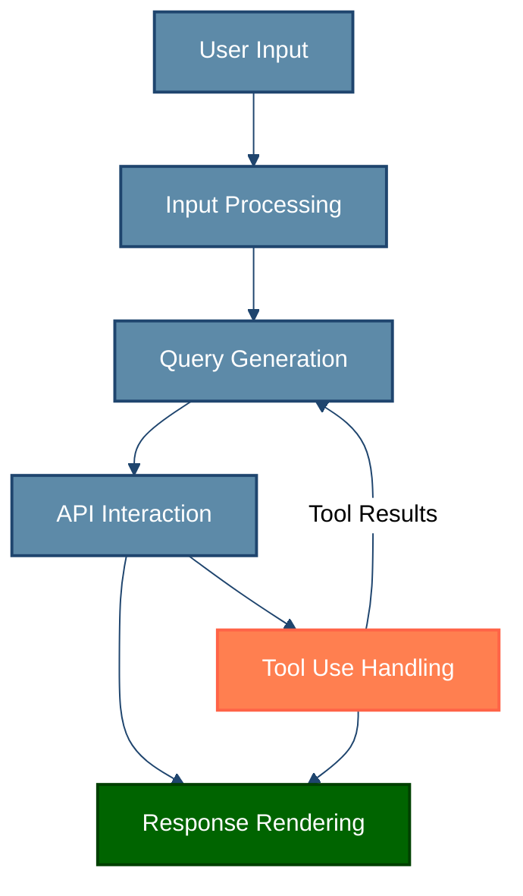
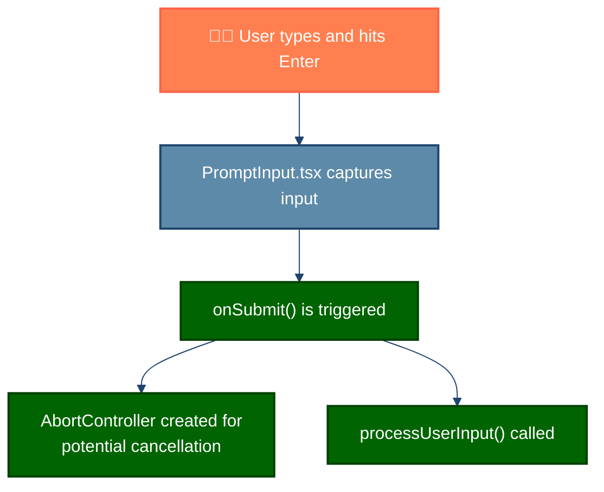
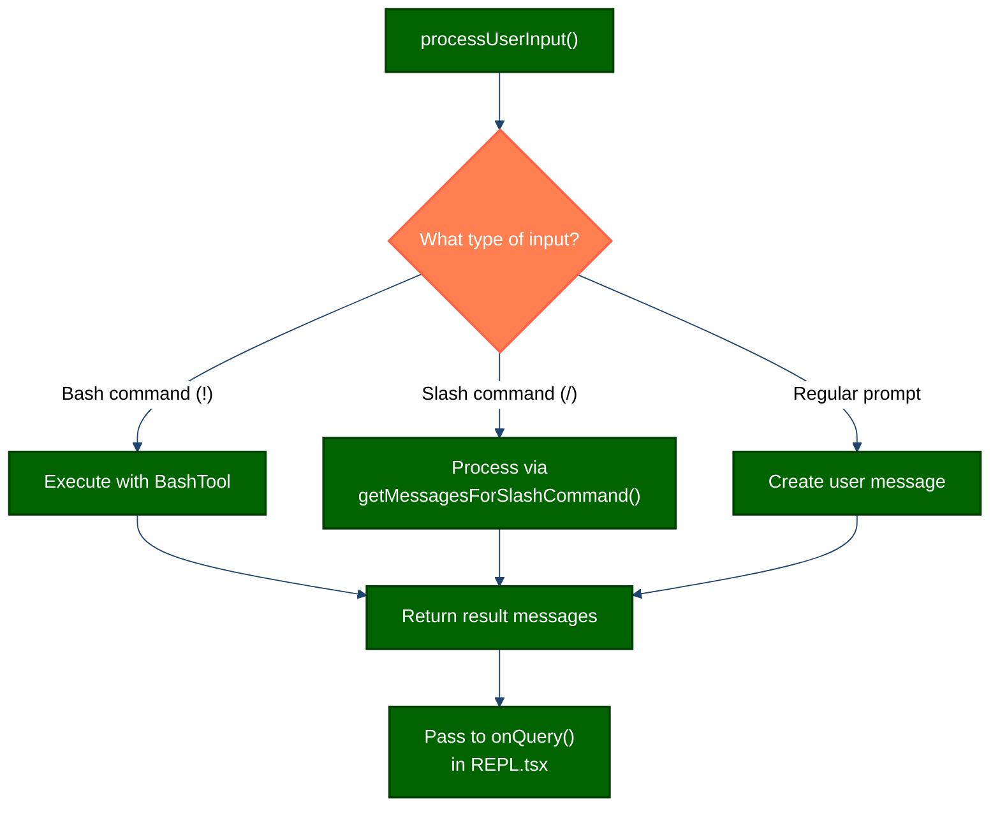
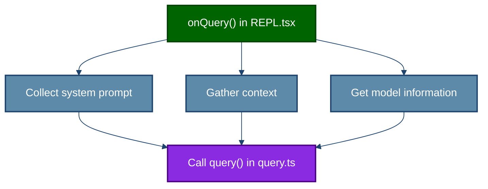
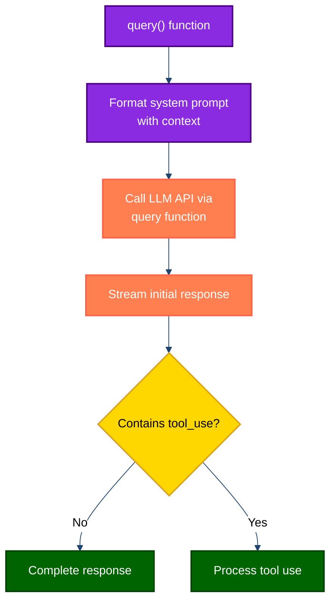
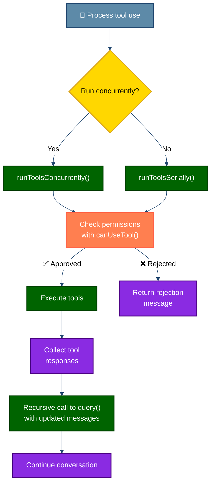
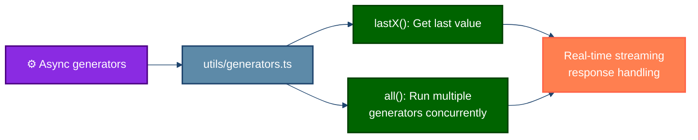
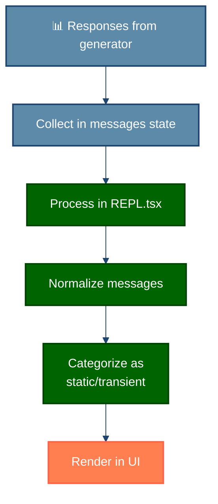

## 详细执行流程

这个执行流程将实时响应性与 AI、工具和 UI 之间的协调结合在一起。与简单的请求-响应模式不同，Agent 系统作为持续的生成器驱动流运行，每个步骤都立即产生结果，无需等待整个过程完成。

核心上，系统全程使用**异步生成器**。这种模式允许结果在可用时立即产生，而不是等待整个操作完成。对于熟悉现代 JavaScript/TypeScript 的开发者来说，这类似于 `async*` 函数可以在完成之前反复 `yield` 值。

让我们跟踪一个典型查询从你按下回车到最终响应的过程：

### 1. 用户输入捕获

一切从用户输入开始。当你输入消息并按下回车时，几个关键步骤立即发生：

<strong>🔍 关键洞察：</strong> 从最初时刻起，系统就建立了一个 <code>AbortController</code>，可以终止执行流中任何位置的任何操作。这种干净的取消机制意味着你可以在任何时候按 Ctrl+C，整个过程都会优雅地终止。

### 2. 输入处理

系统现在评估你提供了哪种类型的输入。有三条不同的路径：

1. **Bash 命令**（以 `!` 为前缀）- 直接发送到 BashTool 立即执行
2. **斜杠命令**（如 `/help` 或 `/compact`）- 由命令系统内部处理
3. **常规提示**- 成为发送到 LLM 的 AI 查询

<strong>💡 工程决策：</strong> 通过给每种输入类型各自的处理路径，系统同时实现了灵活性和性能。Bash 命令和斜杠命令不会浪费 token 或需要 AI 处理，而 AI 导向的查询获得完整的上下文和工具。

### 3. 查询生成

对于需要 AI 智能的标准提示，系统现在将你的输入转换为带有所有必要上下文的完整查询：

<strong>🧩 架构细节：</strong> 上下文收集并行进行以最小化延迟。系统同时收集：
<ul>
<li>系统提示词（AI 指令和能力）</li>
<li>上下文数据（关于你的项目、文件和历史）</li>
<li>模型配置（哪个 AI 模型版本、token 限制等）</li>
</ul>

这个查询准备阶段至关重要，因为系统在此确定要向 AI 模型提供哪些信息和工具。上下文管理经过精心优化，在保持 token 限制内的同时优先考虑最相关的信息。

### 4. 生成器系统核心

现在我们到达架构的核心：生成器系统。这是真正的魔法发生的地方：

<strong>⚡ 性能特性：</strong> <code>query()</code> 函数实现为 <code>async generator</code>。这意味着它可以立即开始流式传输 AI 的响应，逐 token 传输，无需等待完整响应。你会在 UI 中注意到文本逐步出现，就像与人对话一样。

API 交互非常精巧：

1. 首先，使用之前准备的完整上下文建立 API 连接
2. AI 响应在生成时立即开始流式返回
3. 系统监控这些响应以检测任何"工具使用"请求
4. 如果 AI 想使用工具（如搜索文件、读取代码等），响应暂停，等待工具执行
5. 工具执行后，结果反馈给 AI，AI 继续响应

这种架构实现了流畅的对话，AI 可以主动与你的开发环境交互，而不仅仅是孤立地回答你的问题。

### 5. 工具使用处理

当 AI 决定需要更多信息或想在你的系统上采取行动时，它会触发工具使用。这是架构中最精巧的部分之一：

<strong>⚠️ 安全设计：</strong> 所有工具使用都经过权限系统。可能修改你系统的工具（如文件编辑或运行命令）需要明确批准，而只读操作（如读取文件）可能自动执行。这确保你完全控制 AI 可以做什么。

使这个工具系统特别强大的是其并行执行能力：

1. 系统首先确定请求的工具是否可以并发运行
2. 只读工具（如文件搜索和读取）自动并行化
3. 系统修改工具（如文件编辑）串行运行以防止冲突
4. 所有工具操作都受权限系统保护
5. 完成后，结果重新排序以匹配原始序列以保证可预测性

最重要的是，整个工具系统是**递归的**。当 AI 收到工具执行的结果时，它会用这些新信息继续对话。这创建了一个自然的流程，AI 可以：

1. 提出问题
2. 读取文件找到答案
3. 使用信息解决问题
4. 建议并实施更改
5. 验证更改是否成功

……所有这些都在一次无缝交互中完成。

### 6. 异步生成器

整个 Claude Code 架构围绕异步生成器构建。这个基本的设计选择驱动了从 UI 更新到并行执行的一切：

<strong>🔄 技术模式：</strong> 异步生成器（TypeScript/JavaScript 中的 <code>async function*</code>）允许函数随时间异步 yield 多个值。它们结合了 <code>async/await</code> 的能力和产生结果流的能力。

生成器系统提供几项关键能力：

1. **实时反馈** - 结果一旦可用就流式传输到 UI，而不是等所有事情完成之后
2. **可组合的流** - 生成器可以组合、转换和链接在一起
3. **取消支持** - AbortSignals 在整个生成器链中传播，实现干净的终止
4. **并行性** - `all()` 工具可以并发运行多个生成器同时保持顺序
5. **背压处理** - 慢消费者不会导致内存泄漏，因为生成器自然暂停生产

最强大的生成器工具是 `all()`，它支持并发运行多个生成器同时保留其输出。这就是驱动并行工具执行系统的东西，使应用在执行复杂操作时仍然感觉响应迅速。

### 7. 响应处理

执行流程的最后阶段是在终端中向你显示结果：

<strong>🖥️ UI 架构：</strong> 系统使用 React 和 Ink 来渲染丰富的交互式终端 UI。所有 UI 更新都通过流式消息系统发生，该系统保持消息排序并正确处理渐进式（流式）和完整消息。

响应处理系统有几个关键特性：

1. **标准化** - 所有响应，无论来自 AI 还是工具，都被标准化为一致的格式
2. **分类** - 消息被分为"静态"（持久）和"瞬态"（临时，如流式预览）
3. **分块** - 大输出被分成可管理的片段以防止终端延迟
4. **语法高亮** - 代码块根据语言自动进行语法高亮
5. **Markdown 渲染** - 响应通过 Markdown 支持富格式

这个最终步骤将原始响应数据转换为你在终端中看到的精美、交互式体验。

## 关键要点

这个执行流程展示了几个值得纳入你自己的 Agent 系统的创新模式：

1. **流式优先** - 到处使用异步生成器以提供实时反馈和取消支持。

2. **递归智能** - 允许 AI 触发工具使用、接收结果，并用新信息继续。

3. **尽可能并行，必要时串行** - 自动并行化读操作，同时保持写操作串行。

4. **权限边界** - 在只读操作和系统修改操作之间创建清晰的分隔，配以适当的权限门控。

5. **可组合的原语** - 用小型、专注的工具构建，可以以不同方式组合，而不是单体函数。

这些模式创建了一个响应式、安全且灵活的 Agent 架构，可以从简单任务扩展到复杂的多步操作。
