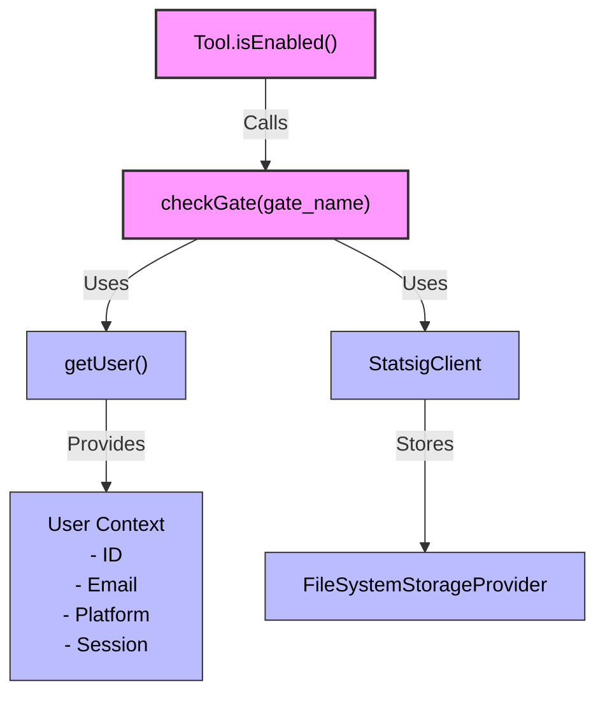
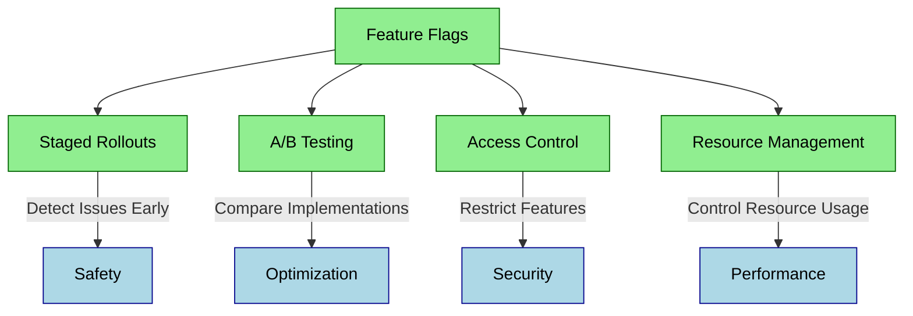
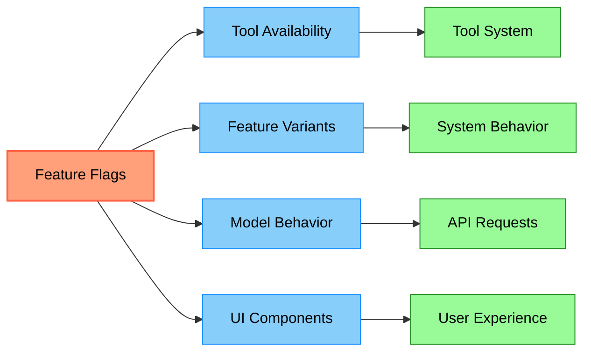

# 功能开关集成

代码库展示了一种使用功能开关系统控制功能可用性的健壮模式。这种方法允许灰度发布和实验性功能。

## 实现模式



功能开关系统遵循以下模式：

1. **开关定义**：每个工具中的 `isEnabled()` 方法控制可用性：

```typescript
async isEnabled() {
  // Tool-specific activation logic
  return Boolean(process.env.SOME_FLAG) && (await checkGate('gate_name'));
}
```

2. **Statsig 客户端**：系统使用 Statsig 实现功能开关，核心函数如下：

```typescript
export const checkGate = memoize(async (gateName: string): Promise<boolean> => {
  // Gate checking logic - currently simplified
  return true;
  // Full implementation would initialize client and check actual flag value
})
```

3. **用户上下文**：开关评估包含来自 `utils/user.ts` 的用户上下文：

```typescript
export const getUser = memoize(async (): Promise<StatsigUser> => {
  const userID = getOrCreateUserID()
  // Collects user information including email, platform, session
  // ...
})
```

4. **持久化**：开关状态使用自定义存储提供者进行缓存：

```typescript
export class FileSystemStorageProvider implements StorageProvider {
  // Stores Statsig data in ~/.claude/statsig/
  // ...
}
```

5. **Gate 模式**：许多工具遵循 ThinkTool 中所见的模式：

```typescript
isEnabled: async () =>
  Boolean(process.env.THINK_TOOL) && (await checkGate('tengu_think_tool')),
```

## 对智能体系统的好处



功能开关为智能体系统提供了几个实际好处：

- **灰度发布**：逐步发布功能以在大范围部署前检测问题
- **A/B 测试**：比较同一功能的不同实现
- **访问控制**：将实验性功能限制在特定用户或环境
- **资源管理**：有选择性地启用资源密集型功能

## 功能开关标准

在你自己的智能体系统中实现功能开关时，可以考虑 [OpenFeature](https://openfeature.dev/)，它提供了跨多种语言实现的标准化 API。

## 在代码库中的使用



在整个代码库中，功能开关控制着：

- **工具可用性**（通过每个工具的 `isEnabled()` 方法）
- **功能变体**（通过实验配置）
- **模型行为**（通过 beta 头部和能力标识）
- **UI 组件**（基于开关状态的条件渲染）

这创建了一个灵活的系统，能力可以在不修改代码的情况下进行调整，非常适合不断演进的智能体系统。
