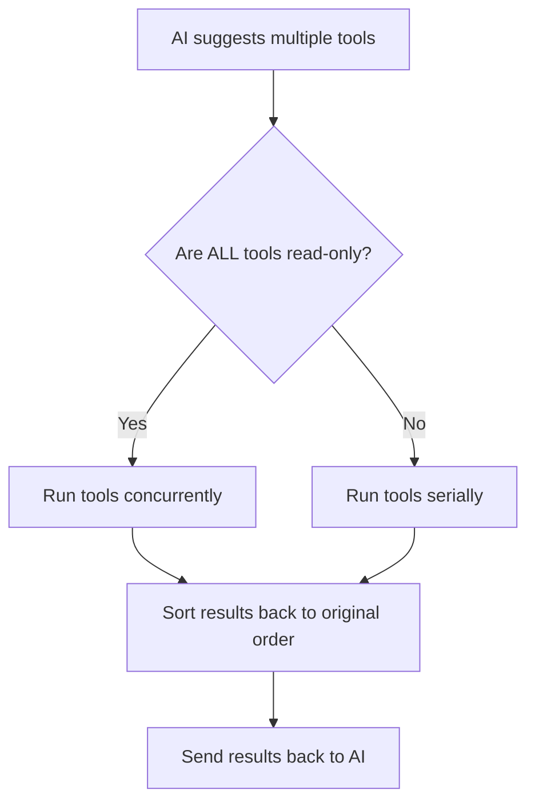

# 并行工具执行

智能体系统可以并行运行工具来加速代码操作。在 AI 工具中实现正确的并行执行并不容易——你需要在维护结果顺序的同时防止写操作上的竞态条件。系统通过将操作分类为只读或有状态来解决这个问题，对每种类型应用不同的执行策略。这种方法将可能需要数分钟的顺序文件操作转变为几秒钟的并发处理。

## 智能调度策略

架构使用一个简单但有效的规则来确定执行策略：



这种方法在性能和安全之间取得平衡：
- **读操作**并行运行（文件读取、搜索），没有冲突风险
- **写操作**顺序执行（文件编辑、bash 命令），避免竞态条件

## 工具分类

系统将工具分为两类，决定它们的执行行为：

### 只读工具（并行安全）

这些工具只读取数据，从不修改状态，因此可以安全地同时运行：

- `GlobTool` - 查找匹配模式的文件，如 "src/**/*.ts"
- `GrepTool` - 搜索文件内容中的文本模式
- `View` - 读取文件内容
- `LS` - 列出目录内容
- `ReadNotebook` - 从 Jupyter notebook 中提取单元格

### 非只读工具（仅顺序执行）

这些工具修改状态，必须逐个运行：

- `Edit` - 对文件进行定向修改
- `Replace` - 覆盖整个文件
- `Bash` - 执行终端命令
- `NotebookEditCell` - 修改 Jupyter notebook 单元格

## 并行执行的底层实现

并发执行由 JavaScript 异步生成器驱动。让我们将实现拆解为可管理的部分：

### 1. 核心生成器工具

系统通过一个中央协调函数管理多个异步生成器：

```typescript
export async function* all<T>(
  generators: Array<AsyncGenerator<T>>,
  options: { signal?: AbortSignal; maxConcurrency?: number } = {}
): AsyncGenerator<T & { generatorIndex: number }> {
  const { signal, maxConcurrency = 10 } = options;
  
  // Track active generators
  const remaining = new Set(generators.map((_, i) => i));
  
  // Map tracks generator state
  const genStates = new Map<number, {
    generator: AsyncGenerator<T>,
    nextPromise: Promise<IteratorResult<T>>,
    done: boolean
  }>();
  
  // More implementation details...
}
```

### 2. 初始化生成器池

系统以不超过并发限制的一批生成器启动：

```typescript
// Initialize first batch (respect max concurrency)
const initialBatchSize = Math.min(generators.length, maxConcurrency);
for (let i = 0; i < initialBatchSize; i++) {
  genStates.set(i, {
    generator: generators[i],
    nextPromise: generators[i].next(),
    done: false
  });
}
```

### 3. 竞争获取结果

系统使用 Promise.race 处理最先完成的生成器：

```typescript
// Process generators until all complete
while (remaining.size > 0) {
  // Check for cancellation
  if (signal?.aborted) {
    throw new Error('Operation aborted');
  }
  
  // Wait for next result from any generator
  const entries = Array.from(genStates.entries());
  const { index, result } = await Promise.race(
    entries.map(async ([index, state]) => {
      const result = await state.nextPromise;
      return { index, result };
    })
  );
  
  // Process result...
}
```

### 4. 处理结果和循环生成器

当结果到达时，系统将其 yield 出来并排队下一个：

```typescript
if (result.done) {
  // This generator is finished
  remaining.delete(index);
  genStates.delete(index);
  
  // Start another generator if available
  const nextIndex = generators.findIndex((_, i) => 
    i >= initialBatchSize && !genStates.has(i));
  
  if (nextIndex >= 0) {
    genStates.set(nextIndex, {
      generator: generators[nextIndex],
      nextPromise: generators[nextIndex].next(),
      done: false
    });
  }
} else {
  // Yield this result with its origin
  yield { ...result.value, generatorIndex: index };
  
  // Queue next value from this generator
  const state = genStates.get(index)!;
  state.nextPromise = state.generator.next();
}
```

## 智能调度执行工具

执行策略根据工具的特性进行自适应：

```typescript
async function executeTools(toolUses: ToolUseRequest[]) {
  // Check if all tools are read-only
  const allReadOnly = toolUses.every(toolUse => {
    const tool = findToolByName(toolUse.name);
    return tool?.isReadOnly();
  });
  
  if (allReadOnly) {
    // Run concurrently for read-only tools
    return runConcurrently(toolUses);
  } else {
    // Run sequentially for any write operations
    return runSequentially(toolUses);
  }
}
```

### 并发执行路径

对于只读操作，系统并行运行所有任务：

```typescript
async function runConcurrently(toolUses) {
  // Convert tool requests to generators
  const generators = toolUses.map(toolUse => {
    const tool = findToolByName(toolUse.name)!;
    return tool.call(toolUse.parameters);
  });
  
  // Collect results with origin tracking
  const results = [];
  for await (const result of all(generators)) {
    results.push({
      ...result,
      toolIndex: result.generatorIndex
    });
  }
  
  // Sort to match original request order
  return results.sort((a, b) => a.toolIndex - b.toolIndex);
}
```

### 顺序执行路径

对于修改状态的操作，系统逐个运行：

```typescript
async function runSequentially(toolUses) {
  const results = [];
  for (const toolUse of toolUses) {
    const tool = findToolByName(toolUse.name)!;
    const generator = tool.call(toolUse.parameters);
    
    // Get all results from this tool before continuing
    for await (const result of generator) {
      results.push(result);
    }
  }
  return results;
}
```

## 性能收益

这种模式以最小的复杂度带来了显著的性能提升。主要优势包括：

1. **可控的并发** - 同时运行最多 10 个工具（可配置）
2. **渐进式结果** - 数据在可用时立即流回，无需等待全部完成
3. **顺序保持** - 结果包含来源信息以保证正确的排序
4. **取消支持** - AbortSignal 传播到所有操作以实现干净的终止
5. **资源管理** - 限制并发操作数以防止系统过载

对于大型代码库，这种方法可以将几分钟的等待变成几秒钟的处理。真正的威力在于组合多个读操作时展现：

```typescript
// Example of multiple tools running simultaneously
const filePatterns = await globTool("src/**/*.ts");
const apiUsageFiles = await grepTool("fetch\\(|axios|request\\(");
const translationFiles = await grepTool("i18n\\.|translate\\(");

// All three operations execute in parallel
// Rather than one after another
```

这种模式对于构建响应式 AI 智能体至关重要。文件 I/O 通常是响应性的主要瓶颈——使这些操作并发执行将用户体验从令人痛苦的缓慢转变为真正的交互式。
