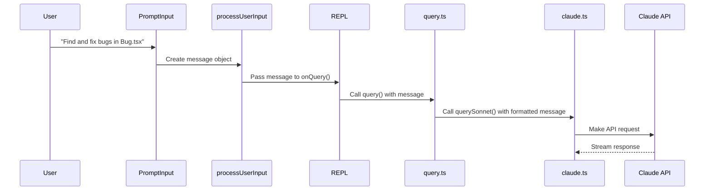
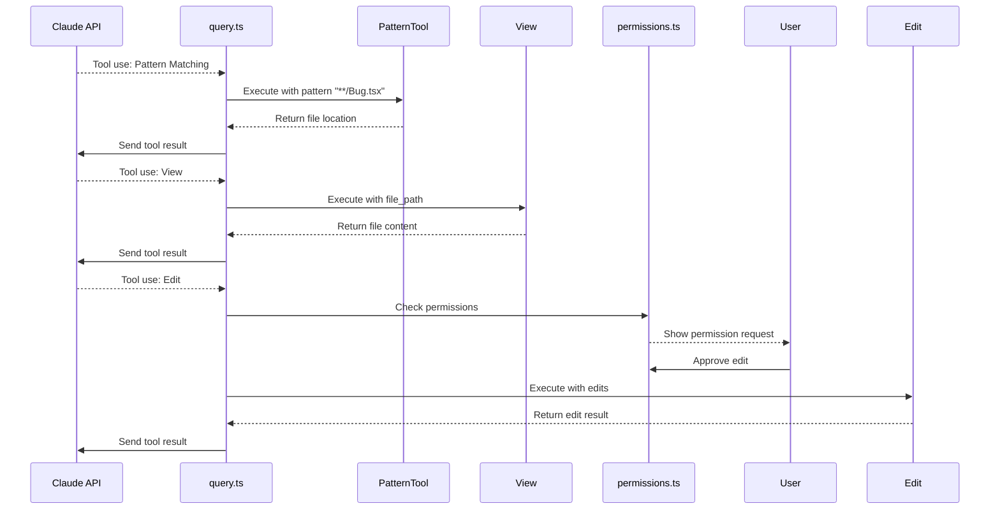
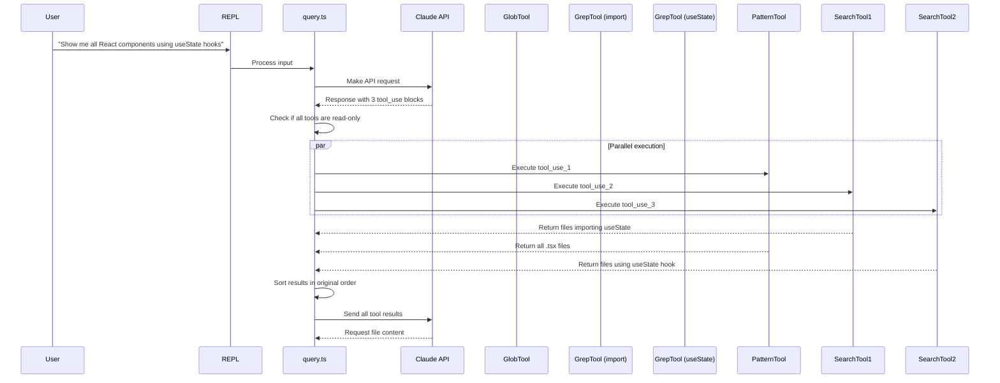

## 实际示例

为了说明所有这些组件如何协同工作，让我们通过两个具体的例子来演示。

### 示例 1：查找并修复 Bug

下面是用户要求 Claude Code "查找并修复文件 Bug.tsx 中的 bug" 的逐步演练：

#### 阶段 1：初始用户输入和处理

1. 用户输入 "Find and fix bugs in the file Bug.tsx" 并按下回车
2. `PromptInput.tsx` 在其 `value` 状态中捕获此输入
3. `onSubmit()` 处理器创建 AbortController 并调用 `processUserInput()`
4. 输入被识别为常规提示（不以 `!` 或 `/` 开头）
5. 创建消息对象：
   ```typescript
   {
     role: 'user',
     content: 'Find and fix bugs in the file Bug.tsx',
     type: 'prompt',
     id: generateId()
   }
   ```
6. 消息传递给 `REPL.tsx` 中的 `onQuery()`

#### 阶段 2：查询生成和 API 调用

1. `onQuery()` 收集：
   - 来自 `getSystemPrompt()` 的系统提示词，包括能力信息
   - 来自 `getContextForQuery()` 的上下文，包括目录结构
   - 来自状态的模型信息
2. 调用 `query.ts` 中的 `query()`，传入消息和选项
3. 消息在 `querySonnet()` 中被格式化为 Claude API 格式
4. 通过 `services/claude.ts` 中的 `fetch()` 向 Claude 发起 API 调用
5. 响应开始流式传输，内容包含查找 bug 的计划



#### 阶段 3：工具使用执行 - 查找文件

1. Claude 决定使用模式匹配工具来定位文件
2. 响应包含 tool_use 块：
   ```json
   {
     "name": "GlobTool",
     "parameters": {
       "pattern": "**/Bug.tsx"
     }
   }
   ```
3. 生成器系统检测到 tool_use 并调用 `runToolsConcurrently()`
4. `canUseTool()` 检查模式匹配工具的权限，该工具无需用户明确批准即可运行
5. 工具使用参数执行，在文件系统上运行文件搜索
6. 返回结果：
   ```
   Found 1 file:
   /path/to/project/src/components/Bug.tsx
   ```

#### 阶段 4：工具使用执行 - 读取文件

1. Claude 决定使用 `View` 来读取文件内容
2. 生成另一个 tool_use 块：
   ```json
   {
     "name": "View",
     "parameters": {
       "file_path": "/path/to/project/src/components/Bug.tsx"
     }
   }
   ```
3. `View.call()` 执行，读取文件内容
4. 结果包含有潜在 bug 的文件内容：
   ```tsx
   import React from 'react';
   import { Box } from 'ink';
   
   interface BugProps {
     message: string;
   }
   
   // Bug: This component tries to access undefinedProp which doesn't exist
   export function Bug({ message }: BugProps) {
     return (
       <Box>
         {message.toUpperCase()}
         {undefinedProp.toString()} // This will cause an error
       </Box>
     );
   }
   ```

#### 阶段 5：工具使用执行 - 编辑文件

1. Claude 决定使用 `Edit` 来修复 bug
2. 生成另一个 tool_use 块：
   ```json
   {
     "name": "Edit",
     "parameters": {
       "file_path": "/path/to/project/src/components/Bug.tsx",
       "old_string": "export function Bug({ message }: BugProps) {\n  return (\n    <Box>\n      {message.toUpperCase()}\n      {undefinedProp.toString()} // This will cause an error\n    </Box>\n  );\n}",
       "new_string": "export function Bug({ message }: BugProps) {\n  return (\n    <Box>\n      {message.toUpperCase()}\n      {/* Removed reference to undefined prop */}\n    </Box>\n  );\n}"
     }
   }
   ```
3. `Edit.needsPermissions` 返回 true，提示用户授权
4. 显示权限请求："Claude wants to edit file /path/to/project/src/components/Bug.tsx"
5. 用户批准编辑
6. `Edit.call()` 执行，修改文件
7. 结果显示编辑成功：
   ```
   The file /path/to/project/src/components/Bug.tsx has been updated. 
   ```



#### 阶段 6：递归查询和最终响应

1. 每次工具执行后，结果被添加到消息数组中：
   ```typescript
   messages.push({
     role: 'assistant',
     content: null,
     tool_use: { ... } // Tool use object
   });
   messages.push({
     role: 'user',
     content: null,
     tool_result: { ... } // Tool result object
   });
   ```
2. 以更新后的消息递归调用 `query()`
3. Claude API 生成总结 bug 修复的最终响应
4. 这个最终响应流式返回到 UI，没有进一步的工具使用
5. 消息被标准化并显示给用户

### 示例 2：并行代码库分析

这个例子展示用户要求 Claude Code "显示所有使用 useState hooks 的 React 组件"：

#### 阶段 1：初始用户输入和处理

与示例 1 一样，输入被捕获、处理，然后传递给查询系统。

#### 阶段 2：Claude 的响应包含多个工具使用

Claude 分析请求并确定它需要：
- 查找所有 React 组件文件
- 搜索 useState hook 的使用
- 读取相关文件以展示组件
   
Claude 不是返回单个工具使用，而是在一个响应中返回多个工具使用：

```json
{
  "content": [
    {
      "type": "tool_use",
      "id": "tool_use_1",
      "name": "GlobTool",
      "parameters": {
        "pattern": "**/*.tsx"
      }
    },
    {
      "type": "tool_use", 
      "id": "tool_use_2",
      "name": "GrepTool",
      "parameters": {
        "pattern": "import.*\\{.*useState.*\\}.*from.*['\"]react['\"]",
        "include": "*.tsx"
      }
    },
    {
      "type": "tool_use",
      "id": "tool_use_3",
      "name": "GrepTool",
      "parameters": {
        "pattern": "const.*\\[.*\\].*=.*useState\\(",
        "include": "*.tsx"
      }
    }
  ]
}
```

#### 阶段 3：并行工具执行

1. `query.ts` 检测到一个响应中有多个工具使用
2. 检查所有工具是否都是只读的（GlobTool 和 GrepTool 都是只读的）
3. 由于所有工具都是只读的，调用 `runToolsConcurrently()`



三个工具的结果被收集，按原始顺序排序，然后发送回 Claude。Claude 随后请求读取特定文件，这些文件也被并行执行，最终生成 useState 使用模式的分析。

这种并行执行通过以下方式显著加快响应时间：
1. 并发运行所有文件搜索操作
2. 并发运行所有文件读取操作
3. 维持结果的正确排序
4. 结果一旦可用就立即流式返回
