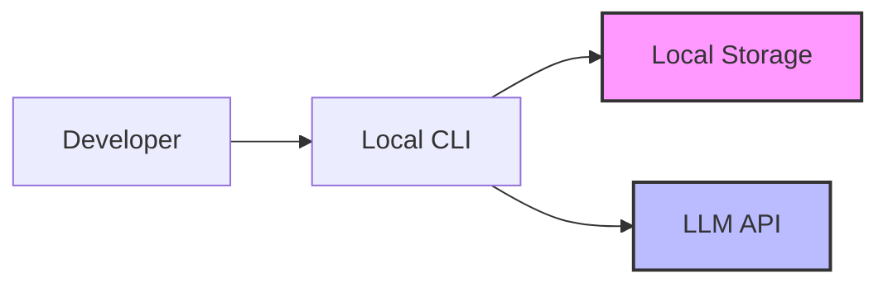
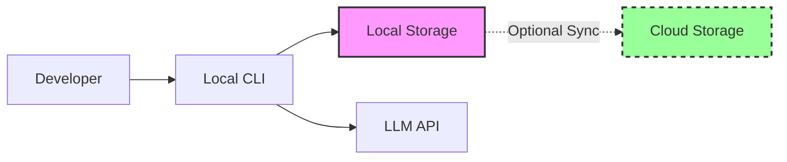
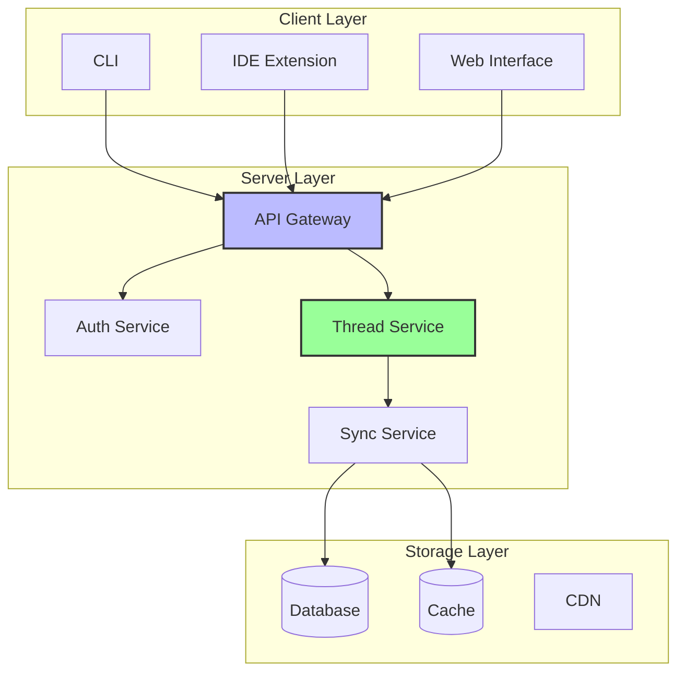

# 第一章：从本地到协作

随着 AI 编程助手变得更加强大，一个根本性的架构矛盾浮现：那些对个人开发者运作良好的工具在团队尝试协作时遇到了硬性限制。从简单的自动补全开始，演变为能够进行复杂推理的自主 Agent，但支撑快速采纳的单用户架构成为了团队生产力的瓶颈。

本章探讨从本地优先到协作式 AI 系统过渡时出现的架构模式，审视团队在将 AI 辅助扩展到个人使用之外时面临的权衡、实现策略和决策点。

## 单用户时代

早期的 AI 编程助手遵循简单的模式：本地运行、本地存储、本地认证。这种方法有几个合理原因：

1. **隐私顾虑** - 开发者对将代码发送到云服务持谨慎态度
2. **简洁性** - 无需维护服务器、无需管理同步
3. **性能** - 直接 API 调用，无中间跳转
4. **控制权** - 用户管理自己的 API 密钥和数据

本地优先模式通常实现以下核心组件：

```typescript
// Local-first storage pattern
interface LocalStorage {
  save(conversation: Conversation): Promise<void>
  load(id: string): Promise<Conversation>
  list(): Promise<ConversationSummary[]>
}

// Direct API authentication pattern  
interface DirectAuth {
  authenticate(apiKey: string): Promise<AuthToken>
  makeRequest(token: AuthToken, request: any): Promise<Response>
}
```

这种架构创建了简单的数据流：用户输入 → 本地处理 → API 调用 → 本地存储。对话历史、API 密钥和所有处理都留在用户的机器上。

这对个人开发者运作良好。但随着 AI 助手变得更加强大，团队开始提出问题：

- "我能把这个对话分享给同事吗？"
- "我们如何在团队中维持一致的上下文？"
- "我们能在实施前审查 AI 的建议吗？"
- "谁来为所有这些 API 调用买单？"

## 协作的必然性

从个人到团队使用的转变不仅仅是便利性的问题——它反映了 AI 工具使用方式的根本性变化。三个关键因素驱动了这一演变：

### 1. "氛围编码"的兴起

随着 AI 助手的改进，一种新的开发模式出现了。开发者不再精确指定每个细节，而是开始描述他们想要的大致"氛围"：

> "Make this component feel more like our design system"
> "Add error handling similar to our other services"
> "Refactor this to match our team's patterns"

这种对话式风格效果很好——但前提是 AI 理解你团队的上下文。本地工具无法提供这种共享理解。

### 2. 知识孤岛

与本地 AI 助手的每次对话都创造了有价值的上下文，但这些上下文对团队来说立即丢失。考虑这个场景：

- Alice 花了一个小时教 Claude Code 团队的认证模式
- Bob 第二天遇到了类似的问题
- Bob 不得不从头重新创建整个对话

将此乘以团队中的每个开发者，低效率变得惊人。

### 3. 企业需求

随着 AI 助手从实验转变为生产工具，企业要求本地优先架构无法提供的功能：

- **审计追踪**用于合规
- **使用量追踪**用于成本管理
- **访问控制**用于安全
- **集中计费**用于采购

## 架构演进

从本地到协作系统的旅程经历了三个不同的阶段：

### 阶段 1：本地优先模式

早期工具将所有内容存储在本地，直接连接 LLM API：



**优势：**
- 完全的隐私
- 无基础设施成本
- 简单的实现
- 用户控制

**局限：**
- 没有协作
- 没有共享上下文
- 分散的 API 密钥
- 没有使用量可见性

### 阶段 2：混合同步模式

一些工具尝试了折中方案，将本地数据同步到可选的云服务：



这种方法增加了复杂性但没有完全解决协作需求。用户不得不管理同步冲突、选择共享内容，仍然缺乏实时协作。

### 阶段 3：服务器优先模式

现代协作系统使用服务器优先的方法，云服务成为数据源：



**优势：**
- 实时协作
- 共享的团队上下文
- 集中管理
- 统一计费
- 跨设备同步

**权衡：**
- 需要网络连接
- 数据离开用户的机器
- 基础设施复杂性
- 运维开销

## 实现服务器优先架构

服务器优先系统需要仔细考虑数据同步和缓存模式。以下是关键的架构决策：

### 存储同步模式

服务器优先系统通常实现三层方法：

```typescript
// Synchronized storage pattern
interface SynchronizedStorage {
  // Local cache for performance
  saveLocal(data: ConversationData): Promise<void>
  
  // Server sync for collaboration  
  syncToServer(data: ConversationData): Promise<void>
  
  // Conflict resolution
  resolveConflicts(local: ConversationData, remote: ConversationData): ConversationData
}
```

这种模式提供：

1. **乐观更新** - 变更立即显示在 UI 中
2. **后台同步** - 数据在不阻塞用户的情况下同步到服务器
3. **冲突解决** - 优雅地处理并发编辑
4. **离线能力** - 在网络不可用时继续工作

**何时使用此模式：**
- 多个用户需要看到相同的数据
- 实时协作很重要
- 用户跨多个设备工作
- 网络连接不可靠

### 实时同步模式

实时协作需要事件驱动的更新。常见模式使用 WebSocket 连接和订阅管理：

```typescript
// Event-driven sync pattern
interface RealtimeSync {
  // Subscribe to changes for a specific resource
  subscribe(resourceType: string, resourceId: string): Observable<UpdateEvent>
  
  // Broadcast changes to other clients
  broadcast(event: UpdateEvent): Promise<void>
  
  // Handle connection management
  connect(): Promise<void>
  disconnect(): Promise<void>
}
```

实时同步的关键考量：

**连接管理：**
- 网络故障时自动重连
- 优雅处理临时断连
- 高效的订阅管理

**更新分发：**
- 基于增量的更新以最小化带宽
- 无冲突的合并策略
- 有序的消息投递

**何时实现实时同步：**
- 用户同时协作
- 变更需要立即可见
- 用户在线状态感知很重要
- 冲突解决可管理

### 集中认证模式

协作系统需要基于团队权限的集中身份管理：

```typescript
// Centralized auth pattern
interface CollaborativeAuth {
  // Identity management
  authenticate(provider: AuthProvider): Promise<UserSession>
  
  // Team-based permissions
  checkPermission(user: User, resource: Resource, action: Action): Promise<boolean>
  
  // Session management
  refreshSession(session: UserSession): Promise<UserSession>
  invalidateSession(sessionId: string): Promise<void>
}
```

关键认证考量：

**身份集成：**
- 企业环境的单点登录（SSO）
- 个人用户的社交认证
- 多因素认证以确保安全

**权限模型：**
- 简单层级的基于角色的访问控制（RBAC）
- 复杂策略的基于属性的访问控制（ABAC）
- 细粒度控制的资源级权限

**会话管理：**
- 安全的 token 存储和传输
- 自动会话刷新
- 优雅处理过期会话

**何时实现集中认证：**
- 多个用户共享资源
- 需要不同的权限级别
- 存在合规或审计要求
- 需要与现有身份系统集成

## 案例研究：从基础设施到 AI 平台

许多成功的协作式 AI 系统源自拥有现有基础设施优势的公司。已经运营开发者平台的组织通常拥有关键构建块：

- 可扩展的认证系统
- 基于团队的权限模型
- 使用量追踪和计费基础设施
- 企业合规工具

在构建协作式 AI 助手时，这些组织可以利用现有基础设施：

1. **认证集成** - 复用已建立的 SSO 和团队模型
2. **上下文来源** - 连接到现有的代码仓库和知识库
3. **可观测性** - 扩展当前的指标和分析平台
4. **企业功能** - 建立在经过验证的审计和合规系统之上

这种方法让 AI 助手感觉与现有工作流程融为一体，而不是需要单独的认证或管理开销。

## 协作优势

向服务器优先架构的转变带来了新的协作工作流：

### 共享上下文模式

团队需要共享知识和维持一致性的机制：

```typescript
// Shared knowledge pattern
interface TeamKnowledge {
  // Shared patterns and conventions
  getPatterns(): Promise<Pattern[]>
  savePattern(pattern: Pattern): Promise<void>
  
  // Team-specific context
  getContext(contextType: string): Promise<ContextData>
  updateContext(contextType: string, data: ContextData): Promise<void>
}
```

共享上下文的好处：
- **一致性** - 团队成员使用相同的模式和约定
- **知识保存** - 最佳实践不会丢失
- **入职培训** - 新团队成员学习已建立的模式
- **演进** - 模式通过集体经验改进

**实现考量：**
- 模式和约定的版本控制
- 搜索和发现机制
- 自动建议相关模式
- 与现有文档系统集成

### 在线状态感知模式

实时协作受益于用户在线状态信息：

```typescript
// Presence awareness pattern
interface PresenceSystem {
  // Track user activity
  updatePresence(userId: string, activity: ActivityInfo): Promise<void>
  
  // Observe presence changes
  observePresence(resourceId: string): Observable<PresenceInfo[]>
  
  // Handle disconnections
  handleDisconnect(userId: string): Promise<void>
}
```

在线状态功能支持：
- **碰撞避免** - 用户看到其他人何时处于活跃状态
- **协调** - 团队了解谁在做什么
- **上下文感知** - 了解当前的活动水平

### 审查和审批工作流

协作系统通常需要审批流程：

```typescript
// Review workflow pattern
interface ReviewSystem {
  // Request review
  requestReview(resourceId: string, reviewType: ReviewType): Promise<Review>
  
  // Approve or reject
  submitReview(reviewId: string, decision: ReviewDecision): Promise<void>
  
  // Track review status
  getReviewStatus(resourceId: string): Promise<ReviewStatus>
}
```

审查模式提供：
- **质量控制** - 变更可以在实施前被审查
- **知识共享** - 团队成员相互学习
- **合规** - 敏感变更的审计追踪
- **风险降低** - 在问题到达生产环境之前捕获

## 经验教训

从本地到协作式 AI 助手的过渡教给了我们宝贵的经验：

### 1. 隐私 vs 生产力

虽然隐私顾虑是真实的，但在提供适当控制的情况下，团队始终选择了生产力：

- 清晰的数据保留策略
- 细粒度的权限模型
- 敏感环境的自托管选项
- SOC2 合规和安全审计

### 2. 同步复杂性

实时同步比看起来更困难：

- 冲突解决需要精心设计
- 网络分区必须优雅处理
- 乐观更新改善感知性能
- 最终一致性通常就足够了

### 3. 性能感知

用户期望基于服务器的工具像本地工具一样快：

- 激进的缓存策略至关重要
- 乐观更新隐藏网络延迟
- 后台同步保持数据新鲜
- CDN 分发用于全球团队

### 4. 迁移挑战

从本地迁移到基于服务器的工具需要仔细规划：

- 现有对话的数据迁移工具
- 过渡期间的向后兼容性
- 关于收益的清晰沟通
- 逐步推出以建立信心

## 决策框架：何时走向协作

从本地到协作的过渡不是自动的。使用此框架评估何时复杂性是合理的：

### 保持本地当：
- 个人或小团队使用（< 3 人）
- 不需要共享上下文
- 安全/隐私限制阻止使用云
- 简单的用例无需复杂工作流
- 基础设施预算有限

### 走向协作当：
- 团队需要共享知识和模式
- 实时协作提供价值
- 需要使用量追踪和成本管理
- 企业合规要求集中控制
- 需要多设备/多位置访问

### 混合方法当：
- 从本地向协作过渡
- 与部分用户测试协作功能
- 同时支持个人和团队工作流
- 偏好渐进式迁移策略

## 模式总结

本地到协作的演进展示了几个关键的架构模式：

1. **存储同步** - 从本地文件到分布式、同步存储
2. **认证演进** - 从个人 API 密钥到集中身份管理
3. **实时协调** - 从孤立会话到共享的在线状态和协作
4. **上下文共享** - 从个人知识到团队范围的模式库
5. **审查工作流** - 从个人决策到团队审批流程

每个模式解决特定的协作需求，同时引入复杂性。理解何时以及如何应用它们，使团队能够构建与组织需求一起扩展的系统。

在下一章中，我们将探讨支持这些协作功能同时保持性能和可靠性的基础架构模式。
