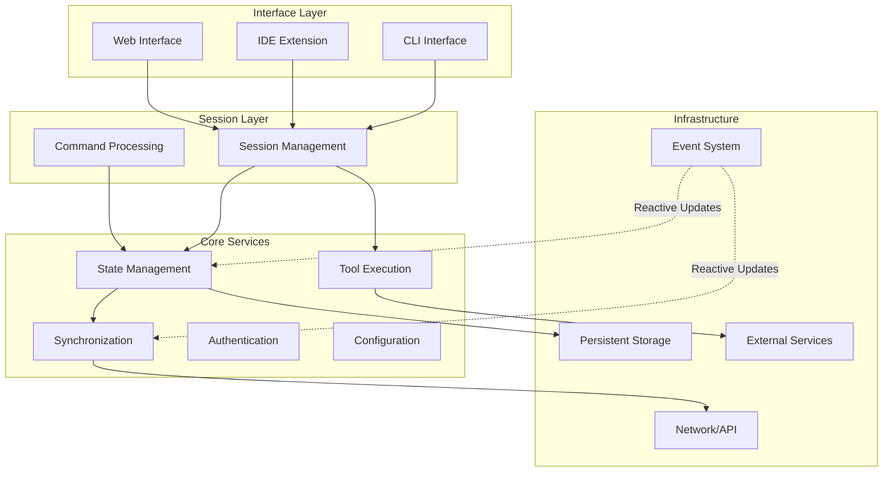
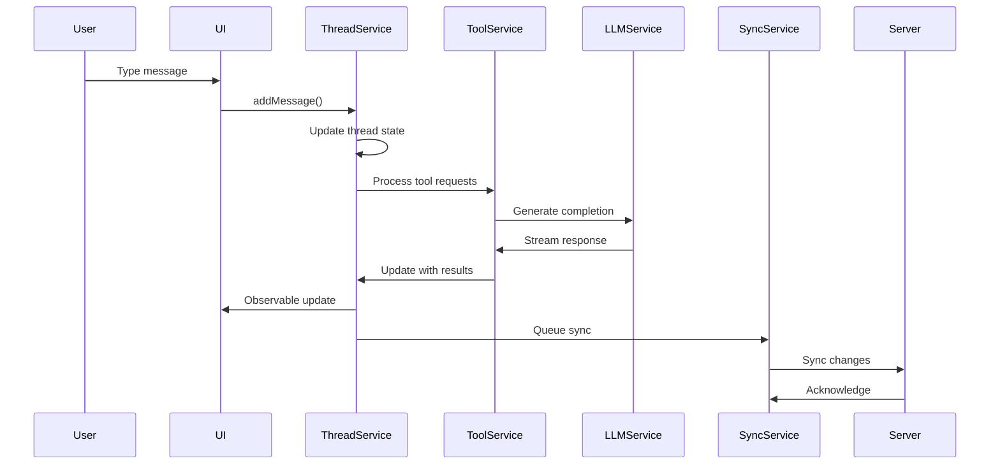

# 第二章：AI 系统的面向服务架构

构建协作式 AI 编程助手需要仔细的架构决策。如何创建一个对单个用户感觉响应迅速的系统，同时管理分布式状态、多用户协作和 AI 模型交互的复杂性？

本章探讨 AI 系统的面向服务架构模式、响应式状态管理方法，以及使团队能够无缝协作同时保持系统可靠性的设计决策。

## 核心设计原则

AI 系统需要平衡响应性、协作和可靠性的架构。五个关键原则指导技术决策：

### 1. 按领域进行服务隔离

每个服务拥有特定的领域，通过明确定义的接口进行通信。这防止了 AI 处理、状态管理和协作功能之间的紧耦合。

**识别模式**：当以下情况时你需要服务隔离：
- 系统的不同部分有不同的故障模式
- 团队需要独立部署功能
- 你在混合实时协作和 AI 处理

**实现方法**：
```typescript
// Service interface defines clear boundaries
interface IThreadService {
  modifyThread(id: string, modifier: ThreadModifier): Promise<Thread>;
  observeThread(id: string): Observable<Thread>;
}

// Implementation handles domain logic without external dependencies
class ThreadService implements IThreadService {
  constructor(
    private storage: IThreadStorage,
    private syncService: ISyncService
  ) {}
}
```

### 2. Observable 优先通信

用响应式流替代回调和 Promise 来处理状态变更。这种模式处理 AI 响应、用户操作和协作更新之间的复杂数据流。

**识别模式**：当以下情况时你需要响应式通信：
- 多个组件需要对相同的状态变更做出反应
- 你在处理来自多个源的实时更新
- UI 需要与快速变化的 AI 输出保持同步

**实现方法**：
```typescript
// Services expose Observable interfaces
interface IThreadService {
  observeThread(id: string): Observable<Thread>;
  observeActiveThread(): Observable<Thread | null>;
}

// Consumers compose reactive streams
threadService.observeActiveThread().pipe(
  filter(thread => thread !== null),
  switchMap(thread => combineLatest([
    of(thread),
    syncService.observeSyncStatus(thread.id)
  ]))
).subscribe(([thread, syncStatus]) => {
  updateUI(thread, syncStatus);
});
```

### 3. 乐观更新

立即更新本地状态同时在后台同步。即使在高延迟的 AI 操作或网络问题下也能提供响应式的用户体验。

**识别模式**：当以下情况时你需要乐观更新：
- 用户期望对其操作得到即时反馈
- 网络延迟影响用户体验
- AI 操作需要多秒才能完成

**实现方法**：
```typescript
// Apply changes locally first, sync later
class OptimisticUpdateService {
  async updateThread(id: string, update: ThreadUpdate): Promise<void> {
    // 1. Apply locally for immediate UI response
    this.applyLocalUpdate(id, update);
    
    // 2. Queue for background synchronization
    this.syncQueue.add({ threadId: id, update, timestamp: Date.now() });
    
    // 3. Process queue without blocking user
    this.processSyncQueue();
  }
}
```

### 4. 优雅降级

即使外部服务不可用也继续运作。AI 系统依赖许多可以独立故障的外部服务（模型、API、协作服务器）。

**识别模式**：当以下情况时你需要优雅降级：
- 你的系统依赖外部 AI API 或协作服务器
- 用户需要在网络中断期间工作
- 系统组件有不同的可用性要求

**实现方法**：
```typescript
// Fallback patterns for service failures
class ResilientService {
  async fetchData(id: string): Promise<Data> {
    try {
      const data = await this.remoteAPI.get(`/data/${id}`);
      await this.localCache.set(id, data); // Cache for offline use
      return data;
    } catch (error) {
      if (this.isNetworkError(error)) {
        return this.localCache.get(id) || this.getDefaultData(id);
      }
      throw error;
    }
  }
}
```

### 5. 显式资源管理

通过一致的生命周期模式防止内存泄漏和资源耗尽。AI 系统经常创建许多订阅、连接和缓存资源。

**识别模式**：当以下情况时你需要显式资源管理：
- 创建 Observable 订阅或 WebSocket 连接
- 缓存 AI 模型响应或用户数据
- 管理后台处理任务

**实现方法**：
```typescript
// Base class ensures consistent cleanup
abstract class BaseService implements IDisposable {
  protected disposables: IDisposable[] = [];
  
  protected addDisposable(disposable: IDisposable): void {
    this.disposables.push(disposable);
  }
  
  dispose(): void {
    this.disposables.forEach(d => d.dispose());
    this.disposables.length = 0;
  }
}
```

## 服务架构模式

AI 系统受益于分层架构，其中每一层有特定的职责和故障模式。这种分离允许不同部分独立演进。



**关键架构决策**：

- **接口层**：多个接口（CLI、IDE、Web）共享相同的会话层
- **会话层**：管理用户上下文并协调服务交互
- **核心服务**：业务逻辑与基础设施关注点隔离
- **基础设施**：处理持久化、网络和外部集成

### 状态管理：对话线程

对话状态服务展示了管理 AI 对话状态并支持协作功能的关键模式。

**核心职责**：
- 维护对话状态和历史
- 确保单写者语义以防止冲突
- 向 UI 组件提供响应式更新
- 处理自动保存和后台同步

**关键模式**：

```typescript
// 1. Single-writer pattern prevents state conflicts
interface IStateManager<T> {
  observeState(id: string): Observable<T>;
  modifyState(id: string, modifier: (state: T) => T): Promise<T>;
}

// 2. Auto-save with throttling prevents excessive I/O
class AutoSaveService {
  setupAutoSave(state$: Observable<State>): void {
    state$.pipe(
      skip(1), // Skip initial value
      throttleTime(1000), // Limit saves to once per second
      switchMap(state => this.storage.save(state))
    ).subscribe();
  }
}

// 3. Lazy loading with caching improves performance
class LazyStateLoader {
  getState(id: string): Observable<State> {
    if (!this.cache.has(id)) {
      this.cache.set(id, this.loadFromStorage(id));
    }
    return this.cache.get(id);
  }
}
```

### 同步服务：桥接本地和远程

ThreadSyncService 管理保持本地和服务器状态同步的复杂协调：

```typescript
export class ThreadSyncService extends BaseService {
  private syncQueue = new Map<string, SyncQueueItem>();
  private syncStatus$ = new Map<string, BehaviorSubject<SyncStatus>>();
  private socket?: WebSocket;
  
  constructor(
    private api: ServerAPIClient,
    private threadService: IThreadService
  ) {
    super();
    this.initializeWebSocket();
    this.startSyncLoop();
  }
  
  private initializeWebSocket(): void {
    this.socket = new WebSocket(this.api.wsEndpoint);
    
    this.socket.on('message', (data) => {
      const message = JSON.parse(data);
      this.handleServerMessage(message);
    });
    
    // Reconnection logic
    this.socket.on('close', () => {
      setTimeout(() => this.initializeWebSocket(), 5000);
    });
  }
  
  async queueSync(threadId: string, thread: Thread): Promise<void> {
    // Calculate changes from last known server state
    const serverVersion = await this.getServerVersion(threadId);
    const changes = this.calculateChanges(thread, serverVersion);
    
    // Add to sync queue
    this.syncQueue.set(threadId, {
      threadId,
      changes,
      localVersion: thread.version,
      serverVersion,
      attempts: 0,
      lastAttempt: null
    });
    
    // Update sync status
    this.updateSyncStatus(threadId, 'pending');
  }
  
  private async processSyncQueue(): Promise<void> {
    for (const [threadId, item] of this.syncQueue) {
      if (this.shouldSync(item)) {
        try {
          await this.syncThread(item);
          this.syncQueue.delete(threadId);
          this.updateSyncStatus(threadId, 'synced');
        } catch (error) {
          this.handleSyncError(threadId, item, error);
        }
      }
    }
  }
  
  private async syncThread(item: SyncQueueItem): Promise<void> {
    const response = await this.api.syncThread({
      threadId: item.threadId,
      changes: item.changes,
      baseVersion: item.serverVersion
    });
    
    if (response.conflict) {
      // Handle conflict resolution using standard patterns
      await this.resolveConflict(item.threadId, response);
    }
  }
  
  private handleServerMessage(message: ServerMessage): void {
    switch (message.type) {
      case 'thread-updated':
        this.handleRemoteUpdate(message);
        break;
      case 'presence-update':
        this.handlePresenceUpdate(message);
        break;
      case 'permission-changed':
        this.handlePermissionChange(message);
        break;
    }
  }
}
```

### Observable 系统：响应式基础

Amp 的自定义 Observable 实现为响应式状态管理提供了基础：

```typescript
// Core Observable implementation
export abstract class Observable<T> {
  abstract subscribe(observer: Observer<T>): Subscription;
  
  pipe<R>(...operators: Operator<any, any>[]): Observable<R> {
    return operators.reduce(
      (source, operator) => operator(source),
      this as Observable<any>
    );
  }
}

// BehaviorSubject maintains current value
export class BehaviorSubject<T> extends Subject<T> {
  constructor(private currentValue: T) {
    super();
  }
  
  get value(): T {
    return this.currentValue;
  }
  
  next(value: T): void {
    this.currentValue = value;
    super.next(value);
  }
  
  subscribe(observer: Observer<T>): Subscription {
    // Emit current value immediately
    observer.next(this.currentValue);
    return super.subscribe(observer);
  }
}

// Rich operator library
export const operators = {
  map: <T, R>(fn: (value: T) => R) => 
    (source: Observable<T>): Observable<R> => 
      new MapObservable(source, fn),
      
  filter: <T>(predicate: (value: T) => boolean) =>
    (source: Observable<T>): Observable<T> =>
      new FilterObservable(source, predicate),
      
  switchMap: <T, R>(fn: (value: T) => Observable<R>) =>
    (source: Observable<T>): Observable<R> =>
      new SwitchMapObservable(source, fn),
      
  throttleTime: <T>(ms: number) =>
    (source: Observable<T>): Observable<T> =>
      new ThrottleTimeObservable(source, ms)
};
```

## 线程模型与数据流

Amp 的线程模型支持包含工具使用、子代理和丰富元数据的复杂对话：

```typescript
interface Thread {
  id: string;                    // Unique identifier
  version: number;               // Version for optimistic updates
  title?: string;                // Thread title
  createdAt: string;             // Creation timestamp
  updatedAt: string;             // Last update timestamp
  sharing?: ThreadSharing;       // Visibility scope
  messages: Message[];           // Conversation history
  metadata?: ThreadMetadata;     // Additional properties
  
  // Thread relationships for hierarchical conversations
  summaryThreadId?: string;      // Link to summary thread
  parentThreadId?: string;       // Parent thread reference
  childThreadIds?: string[];     // Child thread references
}

interface Message {
  id: string;
  type: 'user' | 'assistant' | 'info';
  content: string;
  timestamp: string;
  
  // Tool interactions
  toolUse?: ToolUseBlock[];
  toolResults?: ToolResultBlock[];
  
  // Rich content
  attachments?: Attachment[];
  mentions?: FileMention[];
  
  // Metadata
  model?: string;
  cost?: UsageCost;
  error?: ErrorInfo;
}
```

### 数据在系统中的流动

当用户发送消息时，它通过多个服务流转：



## 服务集成模式

Amp 中的服务通过几种促进松耦合的模式进行集成：

### 1. 构造函数注入

依赖被显式声明和注入：

```typescript
export class ThreadSession {
  constructor(
    private threadService: IThreadService,
    private toolService: IToolService,
    private configService: IConfigService,
    @optional private syncService?: IThreadSyncService
  ) {
    // Services are injected, not created
    this.initialize();
  }
}
```

### 2. 接口隔离

服务依赖接口，而非实现：

```typescript
// Minimal interface for consumers
export interface IThreadReader {
  observeThread(id: string): Observable<Thread | null>;
  observeThreadList(): Observable<ThreadListItem[]>;
}

// Extended interface for writers
export interface IThreadWriter extends IThreadReader {
  modifyThread(id: string, modifier: ThreadModifier): Promise<Thread>;
  deleteThread(id: string): Promise<void>;
}

// Full service interface
export interface IThreadService extends IThreadWriter {
  openThread(id: string): Promise<void>;
  closeThread(id: string): Promise<void>;
  createThread(options?: CreateThreadOptions): Promise<Thread>;
}
```

### 3. 事件驱动通信

服务通过 Observable 流通信：

```typescript
class ConfigService {
  private config$ = new BehaviorSubject<Config>(defaultConfig);
  
  observeConfig(): Observable<Config> {
    return this.config$.asObservable();
  }
  
  updateConfig(updates: Partial<Config>): void {
    const current = this.config$.value;
    const updated = { ...current, ...updates };
    this.config$.next(updated);
  }
}

// Other services react to config changes
class ThemeService {
  constructor(private configService: ConfigService) {
    configService.observeConfig().pipe(
      map(config => config.theme),
      distinctUntilChanged()
    ).subscribe(theme => {
      this.applyTheme(theme);
    });
  }
}
```

### 4. 资源生命周期管理

服务一致地管理资源：

```typescript
abstract class BaseService implements IDisposable {
  protected disposables: IDisposable[] = [];
  protected subscriptions: Subscription[] = [];
  
  protected addDisposable(disposable: IDisposable): void {
    this.disposables.push(disposable);
  }
  
  protected addSubscription(subscription: Subscription): void {
    this.subscriptions.push(subscription);
  }
  
  dispose(): void {
    // Clean up in reverse order
    [...this.subscriptions].reverse().forEach(s => s.unsubscribe());
    [...this.disposables].reverse().forEach(d => d.dispose());
    
    this.subscriptions = [];
    this.disposables = [];
  }
}
```

## 性能模式

Amp 采用多种模式在规模化时保持响应性：

### 1. 使用 Observable 的延迟加载

数据按需加载并缓存：

```typescript
class LazyDataService {
  private cache = new Map<string, BehaviorSubject<Data | null>>();
  
  observeData(id: string): Observable<Data | null> {
    if (!this.cache.has(id)) {
      const subject = new BehaviorSubject<Data | null>(null);
      this.cache.set(id, subject);
      
      // Load data asynchronously
      this.loadData(id).then(data => {
        subject.next(data);
      });
    }
    
    return this.cache.get(id)!.asObservable();
  }
  
  private async loadData(id: string): Promise<Data> {
    // Check memory cache, disk cache, then network
    return this.memCache.get(id) 
        || await this.diskCache.get(id)
        || await this.api.fetchData(id);
  }
}
```

### 2. 背压处理

操作符防止压垮下游消费者：

```typescript
// Throttle rapid updates
threadService.observeActiveThread().pipe(
  throttleTime(100), // Max 10 updates per second
  distinctUntilChanged((a, b) => a?.version === b?.version)
).subscribe(thread => {
  updateExpensiveUI(thread);
});

// Debounce user input
searchInput$.pipe(
  debounceTime(300), // Wait for typing to stop
  distinctUntilChanged(),
  switchMap(query => searchService.search(query))
).subscribe(results => {
  displayResults(results);
});
```

### 3. 乐观并发控制

版本号防止丢失更新：

```typescript
class OptimisticUpdateService {
  async updateThread(id: string, updates: ThreadUpdate): Promise<Thread> {
    const maxRetries = 3;
    let attempts = 0;
    
    while (attempts < maxRetries) {
      try {
        const current = await this.getThread(id);
        const updated = {
          ...current,
          ...updates,
          version: current.version + 1
        };
        
        return await this.api.updateThread(id, updated);
      } catch (error) {
        if (error.code === 'VERSION_CONFLICT' && attempts < maxRetries - 1) {
          attempts++;
          await this.delay(attempts * 100); // Exponential backoff
          continue;
        }
        throw error;
      }
    }
  }
}
```

## 安全和隔离

Amp 的架构在多个层面强制执行安全边界：

### 1. 服务级权限

每个服务独立验证权限：

```typescript
class SecureThreadService extends ThreadService {
  async modifyThread(
    id: string, 
    modifier: ThreadModifier
  ): Promise<Thread> {
    // Check permissions first
    const canModify = await this.permissionService.check({
      user: this.currentUser,
      action: 'thread:modify',
      resource: id
    });
    
    if (!canModify) {
      throw new PermissionError('Cannot modify thread');
    }
    
    return super.modifyThread(id, modifier);
  }
}
```

### 2. 数据隔离

服务按团队维护独立的数据存储：

```typescript
class TeamIsolatedStorage implements IThreadStorage {
  constructor(
    private teamId: string,
    private baseStorage: IStorage
  ) {}
  
  private getTeamPath(threadId: string): string {
    return `teams/${this.teamId}/threads/${threadId}`;
  }
  
  async loadThread(id: string): Promise<Thread> {
    const path = this.getTeamPath(id);
    const data = await this.baseStorage.read(path);
    
    // Verify access permissions
    if (data.teamId !== this.teamId) {
      throw new Error('Access denied: insufficient permissions');
    }
    
    return data;
  }
}
```

### 3. API 网关保护

服务端 API 客户端强制执行认证：

```typescript
class AuthenticatedAPIClient extends ServerAPIClient {
  constructor(
    endpoint: string,
    private authService: IAuthService
  ) {
    super(endpoint);
  }
  
  protected async request<T>(
    method: string,
    path: string,
    data?: any
  ): Promise<T> {
    const token = await this.authService.getAccessToken();
    
    const response = await fetch(`${this.endpoint}${path}`, {
      method,
      headers: {
        'Authorization': `Bearer ${token}`,
        'Content-Type': 'application/json'
      },
      body: data ? JSON.stringify(data) : undefined
    });
    
    if (response.status === 401) {
      // Token expired, refresh and retry
      await this.authService.refreshToken();
      return this.request(method, path, data);
    }
    
    return response.json();
  }
}
```

## 扩展性考量

Amp 的架构通过几个设计决策支持水平扩展：

### 1. 无状态服务

大多数服务除缓存外不维护本地状态：

```typescript
// Services can be instantiated per-request for horizontal scaling
class StatelessThreadService {
  constructor(
    private storage: IThreadStorage,
    private cache: ICache
  ) {
    // No instance state maintained for scalability
  }
  
  async getThread(id: string): Promise<Thread> {
    // Check cache first for performance
    const cached = await this.cache.get(`thread:${id}`);
    if (cached) return cached;
    
    // Load from persistent storage
    const thread = await this.storage.load(id);
    await this.cache.set(`thread:${id}`, thread, { ttl: 300 });
    
    return thread;
  }
}
```

### 2. 分布式缓存

缓存层可以跨实例共享：

```typescript
interface IDistributedCache {
  get<T>(key: string): Promise<T | null>;
  set<T>(key: string, value: T, options?: CacheOptions): Promise<void>;
  delete(key: string): Promise<void>;
  
  // Pub/sub for cache invalidation
  subscribe(pattern: string, handler: (key: string) => void): void;
  publish(key: string, event: CacheEvent): void;
}
```

### 3. 负载均衡支持

WebSocket 连接支持粘性会话：

```typescript
class WebSocketManager {
  private servers: string[] = [
    'wss://server1.example.com',
    'wss://server2.example.com',
    'wss://server3.example.com'
  ];
  
  async connect(sessionId: string): Promise<WebSocket> {
    // Use consistent hashing for session affinity
    const serverIndex = this.hash(sessionId) % this.servers.length;
    const server = this.servers[serverIndex];
    
    const ws = new WebSocket(`${server}?session=${sessionId}`);
    await this.waitForConnection(ws);
    
    return ws;
  }
}
```

## 总结

Amp 的架构展示了如何构建生产就绪的协作式 AI 系统：

- **服务隔离**确保可维护性和可测试性
- **Observable 模式**实现响应式、实时更新
- **乐观更新**提供响应式用户体验
- **精心的资源管理**防止内存泄漏
- **安全边界**保护用户数据
- **扩展性考量**支持增长

这些模式的组合创建了一个基础，可以从服务个人开发者演进到支持整个工程组织。在下一章中，我们将探讨 Amp 的认证和身份系统如何在保持用户期望的简洁性的同时实现安全的多用户协作。
