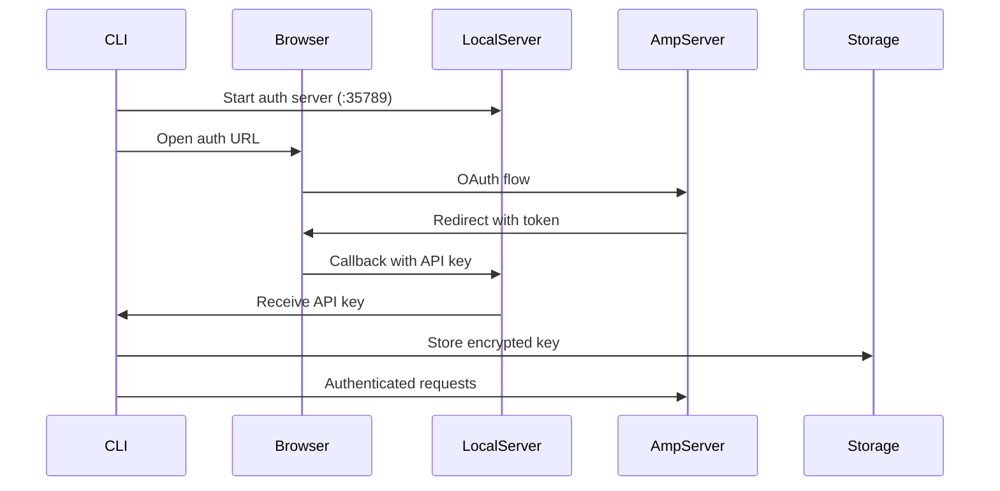

# 第三章：开发者工具的认证与身份

协作式 AI 系统中的认证面临独特挑战。与传统的基于表单登录的 Web 应用不同，AI 编程助手需要在 CLI、IDE 扩展和 Web 界面之间无缝认证，同时维护安全性并支持团队协作。

本章探讨在安全性、易用性和开发者工作流实际需求之间取得平衡的认证模式。

## 认证挑战

为开发者工具构建认证需要解决几个相互竞争的约束：

1. **CLI 优先体验** - 开发者期望无需离开终端即可认证
2. **IDE 集成** - 扩展需要共享认证状态
3. **团队协作** - 多个用户必须访问共享资源
4. **企业安全** - IT 部门要求 SSO 和审计追踪
5. **开发者工作流** - 认证不能打断心流状态

传统的 Web 认证模式在这种环境中失效。基于表单的登录在 CLI 中不可用。会话 cookie 不能在应用之间传递。API 密钥被提交到代码仓库。

## 混合认证架构

开发者工具需要一种混合方法，将 OAuth 的安全性与 API 密钥的简洁性结合起来。这种模式解决了 CLI 认证挑战，同时满足企业安全要求。



### CLI 认证模式

CLI 认证需要与基于 Web 的流程不同的方法。该模式使用临时的本地 HTTP 服务器来接收 OAuth 回调。

**识别模式**：当以下情况时你需要 CLI 认证：
- 用户主要在终端环境中工作
- 基于浏览器的 OAuth 可用但对 CLI 使用不便
- 你需要跨多个应用的安全凭证存储

**核心认证流程**：
1. **生成安全令牌**：创建 CSRF 保护令牌
2. **启动本地服务器**：在 localhost 上启动临时 HTTP 服务器用于 OAuth 回调
3. **打开浏览器**：在用户默认浏览器中启动 OAuth 流程
4. **接收回调**：本地服务器从 OAuth 重定向中接收 API 密钥
5. **安全存储**：使用平台钥匙串保存加密凭证

**实现方法**：
```typescript
// Simplified authentication flow
async function cliLogin(serverUrl: string): Promise<void> {
  const authToken = generateSecureToken();
  const port = await findAvailablePort();
  
  // Start temporary callback server
  const apiKeyPromise = startCallbackServer(port, authToken);
  
  // Open browser for OAuth
  const loginUrl = buildOAuthURL(serverUrl, authToken, port);
  await openBrowser(loginUrl);
  
  // Wait for OAuth completion
  const apiKey = await apiKeyPromise;
  
  // Store credentials securely
  await secureStorage.store('apiKey', apiKey, serverUrl);
}
```

本地回调服务器处理 OAuth 响应：

```typescript
function startAuthServer(
  port: number, 
  expectedToken: string
): Promise<string> {
  return new Promise((resolve, reject) => {
    const server = http.createServer((req, res) => {
      if (req.url?.startsWith('/auth/callback')) {
        const url = new URL(req.url, `http://127.0.0.1:${port}`);
        const apiKey = url.searchParams.get('apiKey');
        const authToken = url.searchParams.get('authToken');
        
        // Validate CSRF token
        if (authToken !== expectedToken) {
          res.writeHead(400);
          res.end('Invalid authentication token');
          reject(new Error('Invalid authentication token'));
          return;
        }
        
        if (apiKey) {
          // Success page for user
          res.writeHead(200, { 'Content-Type': 'text/html' });
          res.end(`
            <html>
              <body>
                <h1>Authentication Successful!</h1>
                <p>You can close this window and return to your terminal.</p>
                <script>window.close();</script>
              </body>
            </html>
          `);
          
          server.close();
          resolve(apiKey);
        }
      }
    });
    
    server.listen(port);
    
    // Timeout after 5 minutes
    setTimeout(() => {
      server.close();
      reject(new Error('Authentication timeout'));
    }, 300000);
  });
}
```

### 令牌存储与管理

API 密钥使用系统的凭证存储安全地保存：

```typescript
export interface ISecretStorage {
  get(name: SecretName, scope: string): Promise<string | undefined>;
  set(name: SecretName, value: string, scope: string): Promise<void>;
  delete(name: SecretName, scope: string): Promise<void>;
  
  // Observable for changes
  readonly changes: Observable<SecretStorageChange>;
}

// Platform-specific implementations
class DarwinSecretStorage implements ISecretStorage {
  async set(name: string, value: string, scope: string): Promise<void> {
    const account = `${name}:${scope}`;
    
    // Use macOS Keychain for secure credential storage
    // The -U flag updates existing entries instead of failing
    await exec(`security add-generic-password \
      -a "${account}" \
      -s "${this.getServiceName()}" \
      -w "${value}" \
      -U`);
  }
  
  async get(name: string, scope: string): Promise<string | undefined> {
    const account = `${name}:${scope}`;
    
    try {
      const result = await exec(`security find-generic-password \
        -a "${account}" \
        -s "${this.getServiceName()}" \
        -w`);
      return result.stdout.trim();
    } catch {
      return undefined;
    }
  }
}

class WindowsSecretStorage implements ISecretStorage {
  async set(name: string, value: string, scope: string): Promise<void> {
    // Use Windows Credential Manager for secure storage
    // This integrates with Windows' built-in credential system
    const target = `${this.getServiceName()}:${name}:${scope}`;
    await exec(`cmdkey /generic:"${target}" /user:${this.getServiceName()} /pass:"${value}"`);
  }
}

class LinuxSecretStorage implements ISecretStorage {
  private secretDir = path.join(os.homedir(), '.config', this.getServiceName(), 'secrets');
  
  async set(name: string, value: string, scope: string): Promise<void> {
    // Fallback to encrypted filesystem storage on Linux
    // Hash scope to prevent directory traversal attacks
    const hashedScope = crypto.createHash('sha256')
      .update(scope)
      .digest('hex');
    
    const filePath = path.join(this.secretDir, name, hashedScope);
    
    // Encrypt value before storage for security
    const encrypted = await this.encrypt(value);
    await fs.mkdir(path.dirname(filePath), { recursive: true });
    // Set restrictive permissions (owner read/write only)
    await fs.writeFile(filePath, encrypted, { mode: 0o600 });
  }
}
```

### 请求认证

认证后，每个 API 请求都包含 Bearer 令牌：

```typescript
export class AuthenticatedAPIClient {
  constructor(
    private baseURL: string,
    private secrets: ISecretStorage
  ) {}
  
  async request<T>(
    method: string,
    path: string,
    body?: unknown
  ): Promise<T> {
    // Retrieve API key for this server
    const apiKey = await this.secrets.get('apiKey', this.baseURL);
    if (!apiKey) {
      throw new Error('Not authenticated. Run "amp login" first.');
    }
    
    const response = await fetch(new URL(path, this.baseURL), {
      method,
      headers: {
        'Authorization': `Bearer ${apiKey}`,
        'Content-Type': 'application/json',
        ...this.getClientHeaders()
      },
      body: body ? JSON.stringify(body) : undefined
    });
    
    if (response.status === 401) {
      // Token expired or revoked
      throw new AuthenticationError('Authentication failed. Please login again.');
    }
    
    return response.json();
  }
  
  private getClientHeaders(): Record<string, string> {
    // Include client identification for analytics tracking
    return {
      'X-Client-Application': this.getClientName(),
      'X-Client-Version': this.getClientVersion(),
      'X-Client-Type': 'cli'
    };
  }
}
```

## 多环境认证

开发者经常使用多个 Amp 实例（生产、预发布、本地开发）。Amp 通过 URL 范围的凭证支持这一点：

```typescript
export class MultiEnvironmentAuth {
  constructor(private storage: ISecretStorage) {}
  
  async setCredential(
    environment: string,
    apiKey: string
  ): Promise<void> {
    const url = this.getURLForEnvironment(environment);
    await this.storage.set('apiKey', apiKey, url);
  }
  
  async getCredential(environment: string): Promise<string | undefined> {
    const url = this.getURLForEnvironment(environment);
    return this.storage.get('apiKey', url);
  }
  
  private getURLForEnvironment(env: string): string {
    const environments = {
      'production': 'https://production.example.com',
      'staging': 'https://staging.example.com',
      'local': 'http://localhost:3000'
    };
    
    return environments[env] || env;
  }
}

// Usage
const auth = new MultiEnvironmentAuth(storage);

// Authenticate against different environments
await auth.setCredential('production', prodApiKey);
await auth.setCredential('staging', stagingApiKey);

// Switch between environments
const config = await loadConfig();
const apiKey = await auth.getCredential(config.environment);
```

## IDE 扩展认证

IDE 扩展通过统一的存储层与 CLI 共享认证状态：

```typescript
// VS Code extension
export class VSCodeAuthProvider implements vscode.AuthenticationProvider {
  private storage: ISecretStorage;
  
  constructor(context: vscode.ExtensionContext) {
    // Use the same storage backend as CLI
    this.storage = createSecretStorage();
    
    // Watch for authentication changes
    this.storage.changes.subscribe(change => {
      if (change.name === 'apiKey') {
        this._onDidChangeSessions.fire({
          added: change.value ? [this.createSession()] : [],
          removed: change.value ? [] : ['*']
        });
      }
    });
  }
  
  async getSessions(): Promise<vscode.AuthenticationSession[]> {
    const apiKey = await this.storage.get('apiKey', this.getServiceURL());
    if (!apiKey) return [];
    
    return [{
      id: 'amp-session',
      accessToken: apiKey,
      account: {
        id: 'amp-user',
        label: 'Amp User'
      },
      scopes: []
    }];
  }
  
  async createSession(): Promise<vscode.AuthenticationSession> {
    // Trigger CLI authentication flow
    const terminal = vscode.window.createTerminal('Amp Login');
    terminal.sendText('amp login');
    terminal.show();
    
    // Wait for authentication to complete
    return new Promise((resolve) => {
      const dispose = this.storage.changes.subscribe(change => {
        if (change.name === 'apiKey' && change.value) {
          dispose();
          resolve(this.createSessionFromKey(change.value));
        }
      });
    });
  }
}
```

## 团队和组织模型

客户端专注于个人认证，服务端管理团队关系：

```typescript
// Server-side models (inferred from client behavior)
interface User {
  id: string;
  email: string;
  name: string;
  createdAt: Date;
  
  // Team associations
  teams: TeamMembership[];
  
  // Usage tracking
  credits: number;
  usage: UsageStats;
}

interface Team {
  id: string;
  name: string;
  slug: string;
  
  // Billing
  subscription: Subscription;
  creditBalance: number;
  
  // Settings
  settings: TeamSettings;
  
  // Members
  members: TeamMembership[];
}

interface TeamMembership {
  userId: string;
  teamId: string;
  role: 'owner' | 'admin' | 'member';
  joinedAt: Date;
}

// Client receives simplified view
interface AuthContext {
  user: {
    id: string;
    email: string;
  };
  team?: {
    id: string;
    name: string;
  };
  permissions: string[];
}
```

## 权限系统

Amp 实现了基于能力的权限系统，而非传统角色：

```typescript
export interface CommandPermission {
  command: string;
  allowed: boolean;
  requiresConfirmation?: boolean;
  reason?: string;
}

export class PermissionService {
  private config: Config;
  
  async checkCommandPermission(
    command: string,
    workingDir: string
  ): Promise<CommandPermission> {
    const allowlist = this.config.get('commands.allowlist', []);
    const blocklist = this.config.get('commands.blocklist', []);
    
    // Universal allow
    if (allowlist.includes('*')) {
      return { command, allowed: true };
    }
    
    // Explicit block
    if (this.matchesPattern(command, blocklist)) {
      return {
        command,
        allowed: false,
        reason: 'Command is blocked by administrator'
      };
    }
    
    // Safe commands always allowed
    if (this.isSafeCommand(command)) {
      return { command, allowed: true };
    }
    
    // Destructive commands need confirmation
    if (this.isDestructiveCommand(command)) {
      return {
        command,
        allowed: true,
        requiresConfirmation: true,
        reason: 'This command may modify your system'
      };
    }
    
    // Default: require confirmation for unknown commands
    return {
      command,
      allowed: true,
      requiresConfirmation: true
    };
  }
  
  private isSafeCommand(command: string): boolean {
    const safeCommands = [
      'ls', 'pwd', 'echo', 'cat', 'grep', 'find',
      'git status', 'git log', 'npm list'
    ];
    
    return safeCommands.some(safe => 
      command.startsWith(safe)
    );
  }
  
  private isDestructiveCommand(command: string): boolean {
    const destructive = [
      'rm', 'mv', 'dd', 'format',
      'git push --force', 'npm publish'
    ];
    
    return destructive.some(cmd => 
      command.includes(cmd)
    );
  }
}
```

## 企业集成

对于企业部署，Amp 通过标准协议支持 SSO：

```typescript
// SAML integration
export class SAMLAuthProvider {
  async initiateSAMLLogin(
    returnUrl: string
  ): Promise<SAMLRequest> {
    const request = {
      id: crypto.randomUUID(),
      issueInstant: new Date().toISOString(),
      assertionConsumerServiceURL: `${this.getServiceURL()}/auth/saml/callback`,
      issuer: this.getServiceURL(),
      returnUrl
    };
    
    // Sign request
    const signed = await this.signRequest(request);
    
    return {
      url: `${this.idpUrl}/sso/saml`,
      samlRequest: Buffer.from(signed).toString('base64')
    };
  }
  
  async processSAMLResponse(
    response: string
  ): Promise<SAMLAssertion> {
    const decoded = Buffer.from(response, 'base64').toString();
    const assertion = await this.parseAndValidate(decoded);
    
    // Extract user information
    const user = {
      email: assertion.subject.email,
      name: assertion.attributes.name,
      teams: assertion.attributes.groups?.map(g => ({
        id: g.id,
        name: g.name,
        role: this.mapGroupToRole(g)
      }))
    };
    
    // Create API key for user
    const apiKey = await this.createAPIKey(user);
    
    return { user, apiKey };
  }
}

// OIDC integration
export class OIDCAuthProvider {
  async initiateOIDCFlow(): Promise<OIDCAuthURL> {
    const state = crypto.randomBytes(32).toString('hex');
    const nonce = crypto.randomBytes(32).toString('hex');
    const codeVerifier = crypto.randomBytes(32).toString('base64url');
    const codeChallenge = crypto
      .createHash('sha256')
      .update(codeVerifier)
      .digest('base64url');
    
    // Store state for validation
    await this.stateStore.set(state, {
      nonce,
      codeVerifier,
      createdAt: Date.now()
    });
    
    const params = new URLSearchParams({
      response_type: 'code',
      client_id: this.clientId,
      redirect_uri: `${this.getServiceURL()}/auth/oidc/callback`,
      scope: 'openid email profile groups',
      state,
      nonce,
      code_challenge: codeChallenge,
      code_challenge_method: 'S256'
    });
    
    return {
      url: `${this.providerUrl}/authorize?${params}`,
      state
    };
  }
}
```

## 使用量追踪与计费

认证与使用量追踪紧密关联，用于计费和配额管理：

```typescript
export class UsageTracker {
  constructor(
    private api: AuthenticatedAPIClient,
    private cache: ICache
  ) {}
  
  async checkQuota(
    operation: 'completion' | 'tool_use',
    estimatedTokens: number
  ): Promise<QuotaCheck> {
    // Check cached quota first to avoid API calls
    const cached = await this.cache.get('quota');
    if (cached && cached.expiresAt > Date.now()) {
      return this.evaluateQuota(cached, operation, estimatedTokens);
    }
    
    // Fetch current usage from server
    const usage = await this.api.request<UsageResponse>(
      'GET',
      '/api/usage/current'
    );
    
    // Cache for 5 minutes
    await this.cache.set('quota', usage, {
      expiresAt: Date.now() + 300000
    });
    
    return this.evaluateQuota(usage, operation, estimatedTokens);
  }
  
  private evaluateQuota(
    usage: UsageResponse,
    operation: string,
    estimatedTokens: number
  ): QuotaCheck {
    const limits = usage.subscription.limits;
    const used = usage.current;
    
    // Check token limits
    if (used.tokens + estimatedTokens > limits.tokensPerMonth) {
      return {
        allowed: false,
        reason: 'Monthly token limit exceeded',
        upgradeUrl: `${this.getServiceURL()}/billing/upgrade`
      };
    }
    
    // Check operation limits
    if (used.operations[operation] >= limits.operationsPerDay[operation]) {
      return {
        allowed: false,
        reason: `Daily ${operation} limit exceeded`,
        resetsAt: this.getNextResetTime()
      };
    }
    
    return { allowed: true };
  }
  
  async trackUsage(
    operation: string,
    tokens: number,
    cost: number
  ): Promise<void> {
    // Fire and forget - don't block user operations on usage tracking
    // Failed tracking shouldn't impact user experience
    this.api.request('POST', '/api/usage/track', {
      operation,
      tokens,
      cost,
      timestamp: new Date().toISOString()
    }).catch(error => {
      console.warn('Failed to track usage:', error);
    });
  }
}
```

## 安全最佳实践

Amp 的认证系统遵循安全最佳实践：

### 1. 令牌轮换

API 密钥可以在不中断服务的情况下轮换：

```typescript
export class TokenRotation {
  async rotateToken(): Promise<void> {
    // Generate new token while old remains valid
    const newToken = await this.api.request<TokenResponse>(
      'POST',
      '/api/auth/rotate-token'
    );
    
    // Store new token
    await this.storage.set('apiKey', newToken.key, this.serverUrl);
    
    // Old token remains valid for grace period
    console.log(`Token rotated. Grace period ends: ${newToken.oldTokenExpiresAt}`);
  }
  
  async setupAutoRotation(intervalDays: number = 90): Promise<void> {
    // Schedule periodic rotation
    setInterval(async () => {
      try {
        await this.rotateToken();
      } catch (error) {
        console.error('Token rotation failed:', error);
      }
    }, intervalDays * 24 * 60 * 60 * 1000);
  }
}
```

### 2. 范围限制

令牌可以限定到特定操作：

```typescript
interface ScopedToken {
  key: string;
  scopes: TokenScope[];
  expiresAt?: Date;
}

interface TokenScope {
  resource: 'threads' | 'tools' | 'admin';
  actions: ('read' | 'write' | 'delete')[];
}

// Example: Create limited scope token for automation
const automationToken = await createScopedToken({
  scopes: [{
    resource: 'threads',
    actions: ['read']
  }, {
    resource: 'tools',
    actions: ['read', 'write']
  }],
  expiresAt: new Date(Date.now() + 3600000) // 1 hour
});
```

### 3. 审计日志

所有经过认证的操作都被记录：

```typescript
export class AuditLogger {
  async logAction(
    action: string,
    resource: string,
    details?: Record<string, unknown>
  ): Promise<void> {
    const entry: AuditEntry = {
      timestamp: new Date().toISOString(),
      userId: this.currentUser.id,
      teamId: this.currentTeam?.id,
      action,
      resource,
      details,
      
      // Client context
      clientIP: this.request.ip,
      clientApplication: this.request.headers['x-client-application'],
      clientVersion: this.request.headers['x-client-version']
    };
    
    await this.api.request('POST', '/api/audit/log', entry);
  }
}
```

## 认证挑战与解决方案

为 Amp 构建认证揭示了几个挑战：

### 挑战 1：无浏览器环境

一些用户在没有浏览器的环境中工作（SSH 会话、容器）。

**解决方案**：设备授权流程作为后备：

```typescript
export async function deviceLogin(): Promise<void> {
  // Request device code
  const device = await api.request<DeviceCodeResponse>(
    'POST',
    '/api/auth/device/code'
  );
  
  console.log(`
To authenticate, visit: ${device.verification_url}
Enter code: ${device.user_code}
  `);
  
  // Poll for completion
  const token = await pollForDeviceToken(device.device_code);
  await storage.set('apiKey', token);
}
```

### 挑战 2：凭证泄漏

开发者意外将凭证提交到代码仓库。

**解决方案**：自动凭证检测：

```typescript
export class CredentialScanner {
  private patterns = [
    /[a-zA-Z0-9_]+_[a-zA-Z0-9]{32}/g,  // API key pattern
    /Bearer [a-zA-Z0-9\-._~+\/]+=*/g  // Bearer tokens
  ];
  
  async scanFile(path: string): Promise<CredentialLeak[]> {
    const content = await fs.readFile(path, 'utf-8');
    const leaks: CredentialLeak[] = [];
    
    for (const pattern of this.patterns) {
      const matches = content.matchAll(pattern);
      for (const match of matches) {
        leaks.push({
          file: path,
          line: this.getLineNumber(content, match.index),
          pattern: pattern.source,
          severity: 'high'
        });
      }
    }
    
    return leaks;
  }
}
```

### 挑战 3：多账户支持

开发者需要在个人和工作账户之间切换。

**解决方案**：基于配置文件的认证：

```typescript
export class AuthProfiles {
  async createProfile(name: string): Promise<void> {
    const profile: AuthProfile = {
      name,
      serverUrl: await this.promptForServer(),
      createdAt: new Date()
    };
    
    await this.storage.set(`profile:${name}`, profile);
  }
  
  async switchProfile(name: string): Promise<void> {
    const profile = await this.storage.get(`profile:${name}`);
    if (!profile) {
      throw new Error(`Profile ${name} not found`);
    }
    
    // Update active profile
    await this.config.set('activeProfile', name);
    await this.config.set('serverUrl', profile.serverUrl);
  }
  
  async listProfiles(): Promise<AuthProfile[]> {
    const profiles = await this.storage.list('profile:*');
    return profiles.map(p => p.value);
  }
}
```

## 总结

Amp 的认证系统展示了如何为开发者工具构建安全、用户友好的认证：

- **带有 CLI 回调的 OAuth 流程**提供安全性而无需离开终端
- **平台特定的密钥存储**保持凭证安全
- **URL 范围的凭证**支持多环境
- **共享存储**实现无缝的 IDE 集成
- **基于能力的权限**提供细粒度控制
- **企业集成**支持 SSO 要求

关键洞察是，开发者工具的认证必须适应开发者的工作流程，而不是反过来。通过在开发者工作的地方——终端、IDE 和 CI/CD 管道——与他们会面，Amp 创建了增强而非打断生产力的认证体验。

在下一章中，我们将探讨 Amp 如何在规模化管理对话线程，处理同步、冲突和协作式 AI 交互的版本控制。
