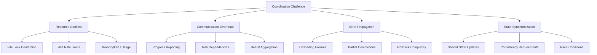
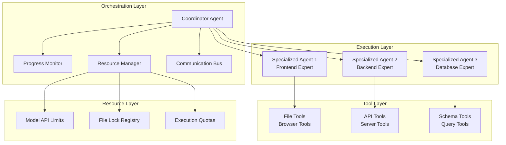
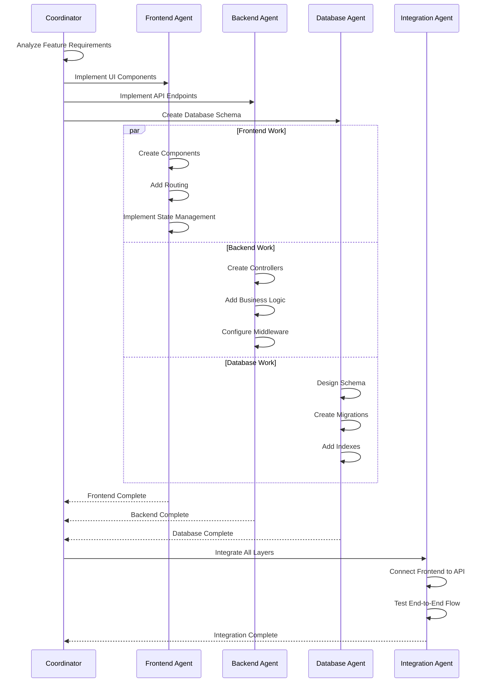
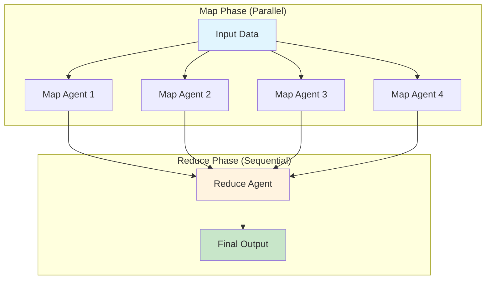

# 第十章：多智能体编排模式

随着 AI 编码助手处理的任务日益复杂，单个智能体往往力不从心。重构整个代码库、迁移框架、或跨多个服务实现功能，都需要专业化智能体之间的协调配合。本章探讨多智能体工作流的模式，涵盖分层任务委派、并行执行和智能资源管理。

## 多智能体系统的必要性

考虑一个典型的企业级功能需求："在我们的 Web 应用、移动应用和后端服务中添加用户分析追踪。"单个智能体尝试完成这项任务时面临几个挑战：

1. **上下文窗口限制** - 无法将所有相关代码同时加载到内存中
2. **专业边界** - 前端、移动端和后端需要不同的领域知识
3. **并行机会** - 许多子任务可以同时执行
4. **认知过载** - 复杂任务适合分而治之的策略

多智能体编排通过将工作分解为聚焦的子任务来解决这些挑战，每个子任务由专业化的智能体处理。

### 何时使用多智能体系统

当遇到以下场景时，多智能体编排就显得尤为重要：

**✅ 适合使用多智能体的场景：**

- 任务跨越多个领域（前端 + 后端 + 数据库）
- 工作可以并行化（独立的组件或服务）
- 单个智能体触及上下文限制（大型代码库、复杂迁移）
- 任务需要专业技能（安全审查、性能优化）
- 用户需要了解长时间运行操作的进度
- 风险缓解很重要（共识验证、冗余执行）

**❌ 不适合使用多智能体的场景：**

- 简单聚焦的任务，单个智能体的上下文即可覆盖
- 子任务之间紧密耦合，需要频繁协调
- 资源限制使并行执行不切实际
- 任务完成时间比质量/彻底性更重要
- 调试复杂度超过了收益

### 协调挑战

多智能体系统引入了单智能体中不存在的新复杂性：



理解这些挑战对于设计能处理真实场景复杂性的健壮编排系统至关重要，同时还要保持可靠性和性能。

## 分层智能体架构

健壮的多智能体系统需要一个具有明确父子关系的分层模型：



这种架构在实现高效协调和资源管理的同时提供了清晰的关注点分离。

```typescript
// Core interface defining the hierarchical structure of our multi-agent system
interface AgentHierarchy {
  coordinator: ParentAgent;        // Top-level agent that orchestrates the workflow
  workers: SpecializedAgent[];     // Child agents with specific domain expertise
  communication: MessageBus;       // Handles inter-agent messaging and status updates
  resourceManager: ResourceManager; // Prevents conflicts and manages resource allocation
}

class SpecializedAgent {
  // Each agent has limited capabilities to prevent unauthorized actions
  private capabilities: AgentCapability[];
  // Isolated tool registry ensures agents can't access tools outside their domain
  private toolRegistry: ToolRegistry;
  // Resource limits prevent any single agent from consuming excessive resources
  private resourceLimits: ResourceLimits;
  
  constructor(config: AgentConfiguration) {
    // Create an isolated execution environment for security and reliability
    this.capabilities = config.allowedCapabilities;
    this.toolRegistry = this.createIsolatedTools(config.tools);
    this.resourceLimits = config.limits;
  }
  
  /**
   * Creates a sandboxed tool registry for this agent
   * This prevents agents from accessing tools they shouldn't have
   * Example: A frontend agent won't get database tools
   */
  private createIsolatedTools(allowedTools: ToolDefinition[]): ToolRegistry {
    const registry = new ToolRegistry();
    
    // Only register tools explicitly allowed for this agent's role
    allowedTools.forEach(tool => registry.register(tool));
    
    // Critically important: No access to parent's tool registry
    // This prevents privilege escalation and maintains security boundaries
    return registry;
  }
}
```

生产系统的关键架构决策：

1. **模型选择策略** - 在不同层级的智能体之间平衡性能和成本
2. **工具隔离** - 每个智能体只获得其角色所需的工具
3. **资源边界** - 独立的执行上下文防止级联故障
4. **可观测的协调** - 父智能体通过响应式模式监控子智能体

## 任务分解模式

高效的多智能体系统需要精心的任务分解。关键在于根据具体的任务特征和约束选择正确的分解策略。

### 选择分解策略

| 模式 | 适用场景 | 避免使用场景 | 示例用例 |
|---------|----------|------------|------------------|
| **功能分解** | 多领域任务 | 领域间紧密耦合 | 全栈功能实现 |
| **空间分解** | 基于文件/目录的工作 | 复杂依赖关系 | 大规模重构 |
| **时间分解** | 阶段依赖的流程 | 存在并行机会 | 框架迁移 |
| **数据驱动** | 处理大型数据集 | 小型、内聚的数据 | 日志分析、批处理 |

### 模式一：功能分解

**适用场景：** 按技术专业或系统层级自然划分的任务。

**为何有效：** 每个智能体可以专注于特定领域的知识和工具，减少上下文切换并提高质量。

按技术领域或专业拆分：

```typescript
class FeatureImplementationCoordinator {
  /**
   * Implements a feature by breaking it down by technical domains
   * This is the main entry point for functional decomposition
   */
  async implementFeature(description: string): Promise<void> {
    // Step 1: Analyze what the feature needs across different domains
    // This determines which specialized agents we'll need to spawn
    const analysis = await this.analyzeFeature(description);
    
    // Step 2: Build configurations for each required domain agent
    // Each agent gets only the tools and context it needs for its domain
    const agentConfigurations: AgentConfig[] = [];
    
    // Frontend agent: Handles UI components, routing, state management
    if (analysis.requiresFrontend) {
      agentConfigurations.push({
        domain: 'frontend',
        task: `Implement frontend for: ${description}`,
        focus: analysis.frontendRequirements,
        toolset: this.getFrontendTools(),  // Only React/Vue/Angular tools
        systemContext: this.getFrontendContext()  // Component patterns, styling guides
      });
    }
    
    // Backend agent: Handles APIs, business logic, authentication
    if (analysis.requiresBackend) {
      agentConfigurations.push({
        domain: 'backend',
        task: `Implement backend for: ${description}`,
        focus: analysis.backendRequirements,
        toolset: this.getBackendTools(),  // Only server-side tools (Node.js, databases)
        systemContext: this.getBackendContext()  // API patterns, security guidelines
      });
    }
    
    // Database agent: Handles schema changes, migrations, indexing
    if (analysis.requiresDatabase) {
      agentConfigurations.push({
        domain: 'database',
        task: `Implement database changes for: ${description}`,
        focus: analysis.databaseRequirements,
        toolset: this.getDatabaseTools(),  // Only DB tools (SQL, migrations, schema)
        systemContext: this.getDatabaseContext()  // Data patterns, performance rules
      });
    }
    
    // Step 3: Execute all domain agents in parallel
    // This is safe because they work on different parts of the system
    const results = await this.orchestrator.executeParallel(agentConfigurations);
    
    // Step 4: Integrate the results from all domains
    // This ensures the frontend can talk to the backend, etc.
    await this.integrateResults(results);
  }
}
```

**功能分解流程：**



### 模式二：空间分解

**适用场景：** 涉及大量文件或目录，且可以独立处理的任务。

**为何有效：** 通过确保智能体在代码库的不同部分工作来最小化冲突，实现真正的并行处理。

按文件或目录结构拆分：

```typescript
class CodebaseRefactoringAgent {
  /**
   * Refactors a codebase by dividing work spatially (by files/directories)
   * This approach ensures agents don't conflict by working on different files
   */
  async refactorCodebase(pattern: string, transformation: string): Promise<void> {
    // Step 1: Find all files that match our refactoring pattern
    // Example: "**/*.ts" finds all TypeScript files
    const files = await this.glob(pattern);
    
    // Step 2: Intelligently group files to minimize conflicts
    // Files that import each other should be in the same group
    const fileGroups = this.groupFilesByDependency(files);
    
    // Step 3: Process each group with a dedicated agent
    // Sequential processing ensures no file lock conflicts
    for (const group of fileGroups) {
      await this.spawnAgent({
        prompt: `Apply transformation to files: ${group.join(', ')}
                 Transformation: ${transformation}
                 Ensure changes are consistent across all files.`,
        tools: [readFileTool, editFileTool, grepTool],  // Minimal toolset for safety
        systemPrompt: REFACTORING_SYSTEM_PROMPT
      });
    }
  }
  
  /**
   * Groups files by their dependencies to avoid breaking changes
   * Files that import each other are processed together for consistency
   */
  private groupFilesByDependency(files: string[]): string[][] {
    // Track which files we've already assigned to groups
    const groups: string[][] = [];
    const processed = new Set<string>();
    
    // Process each file and its dependencies together
    for (const file of files) {
      if (processed.has(file)) continue;  // Skip if already in a group
      
      // Start a new group with this file
      const group = [file];
      
      // Find all dependencies of this file
      const deps = this.findDependencies(file);
      
      // Add dependencies to the same group if they're in our file list
      for (const dep of deps) {
        if (files.includes(dep) && !processed.has(dep)) {
          group.push(dep);
          processed.add(dep);  // Mark as processed
        }
      }
      
      processed.add(file);  // Mark the original file as processed
      groups.push(group);   // Add this group to our list
    }
    
    return groups;
  }
}
```

### 模式三：时间分解

**适用场景：** 具有明确顺序阶段的任务，后续阶段依赖前序阶段的输出。

**为何有效：** 确保每个阶段在下一阶段开始前完全结束，降低复杂性并支持针对特定阶段的优化。

**代码任务中常见的阶段：**

- 分析 → 规划 → 实现 → 验证
- 备份 → 迁移 → 测试 → 回滚准备

按执行阶段拆分：

```typescript
class MigrationAgent {
  /**
   * Migrates a codebase from one framework to another using temporal decomposition
   * Each phase must complete successfully before the next phase begins
   */
  async migrateFramework(from: string, to: string): Promise<void> {
    // Phase 1: Analysis - Understand what needs to be migrated
    // This phase is read-only and safe to run without any risk
    const analysisAgent = await this.spawnAgent({
      prompt: `Analyze codebase for ${from} usage patterns.
               Document all framework-specific code.
               Identify migration risks and dependencies.`,
      tools: [readFileTool, grepTool, globTool],  // Read-only tools for safety
      systemPrompt: ANALYSIS_SYSTEM_PROMPT
    });
    
    // Wait for analysis to complete before proceeding
    // This ensures we have a complete understanding before making changes
    const analysis = await analysisAgent.waitForCompletion();
    
    // Phase 2: Preparation - Set up the codebase for migration
    // Creates safety nets and abstraction layers before the real migration
    const prepAgent = await this.spawnAgent({
      prompt: `Prepare codebase for migration based on analysis:
               ${analysis.summary}
               Create compatibility shims and abstraction layers.`,
      tools: [readFileTool, editFileTool, createFileTool],  // Can create files but limited scope
      systemPrompt: PREPARATION_SYSTEM_PROMPT
    });
    
    // Must complete preparation before starting actual migration
    await prepAgent.waitForCompletion();
    
    // Phase 3: Migration - The main migration work
    // Now we can safely migrate each component in parallel
    // This is possible because Phase 2 prepared abstraction layers
    const migrationAgents = analysis.components.map(component =>
      this.spawnAgent({
        prompt: `Migrate ${component.name} from ${from} to ${to}.
                 Maintain functionality while updating syntax.`,
        tools: ALL_TOOLS,  // Full tool access needed for comprehensive migration
        systemPrompt: MIGRATION_SYSTEM_PROMPT
      })
    );
    
    // Wait for all migration agents to complete
    await Promise.all(migrationAgents);
    
    // Phase 4: Verification - Ensure everything works
    // This phase validates the migration and fixes any issues
    const verifyAgent = await this.spawnAgent({
      prompt: `Verify migration success. Run tests and fix any issues.`,
      tools: [bashTool, editFileTool, readFileTool],  // Needs bash to run tests
      systemPrompt: VERIFICATION_SYSTEM_PROMPT
    });
    
    // Final verification must complete for migration to be considered successful
    await verifyAgent.waitForCompletion();
  }
}
```

## 智能体通信协议

高效的多智能体系统需要结构化的通信协议：

```typescript
interface AgentStatus {
  state: 'initializing' | 'active' | 'completed' | 'failed';
  progress: AgentProgress;
  currentTask?: string;
  error?: ErrorContext;
  metrics?: PerformanceMetrics;
}

interface AgentProgress {
  steps: ExecutionStep[];
  currentStep: number;
  estimatedCompletion?: Date;
}

interface ExecutionStep {
  description: string;
  status: 'pending' | 'active' | 'completed' | 'failed';
  tools: ToolExecution[];
}

class AgentCoordinator {
  private monitorAgent(agent: ManagedAgent): void {
    agent.subscribe(status => {
      switch (status.state) {
        case 'active':
          this.handleProgress(agent.id, status);
          break;
          
        case 'completed':
          this.handleCompletion(agent.id, status);
          break;
          
        case 'failed':
          this.handleFailure(agent.id, status);
          break;
      }
    });
  }
  
  private handleProgress(agentId: string, status: AgentStatus): void {
    // Track progress for coordination
    this.progressTracker.update(agentId, status.progress);
    
    // Monitor for coordination opportunities
    if (status.progress.currentStep) {
      const step = status.progress.steps[status.progress.currentStep];
      this.checkForCollaboration(agentId, step);
    }
  }
}
```

## 资源管理

多智能体系统必须仔细管理资源以防止冲突和资源耗尽：

### 工具访问控制

```typescript
// Define tool sets for different agent types
export const ANALYSIS_TOOLS: ToolRegistration[] = [
  readFileToolReg,
  grepToolReg,
  globToolReg,
  listDirectoryToolReg
];

export const MODIFICATION_TOOLS: ToolRegistration[] = [
  ...ANALYSIS_TOOLS,
  editFileToolReg,
  createFileToolReg,
  deleteFileToolReg
];

export const EXECUTION_TOOLS: ToolRegistration[] = [
  ...MODIFICATION_TOOLS,
  bashToolReg // Dangerous - only for trusted agents
];

// Sub-agents get minimal tools by default
export const DEFAULT_SUBAGENT_TOOLS: ToolRegistration[] = [
  readFileToolReg,
  editFileToolReg,
  grepToolReg
];
```

### 并发控制

```typescript
/**
 * Manages concurrency and prevents conflicts between multiple agents
 * This is critical for preventing file corruption and resource contention
 */
class ConcurrencyManager {
  // Track all currently active agents
  private activeAgents = new Map<string, SubAgent>();
  // Track which agent has a lock on which file (prevents concurrent edits)
  private fileLocksMap = new Map<string, string>(); // file -> agentId
  
  /**
   * Attempts to acquire an exclusive lock on a file for an agent
   * Returns true if the lock was acquired, false if another agent has it
   */
  async acquireFileLock(agentId: string, file: string): Promise<boolean> {
    const existingLock = this.fileLocksMap.get(file);
    
    // Check if another agent already has this file locked
    if (existingLock && existingLock !== agentId) {
      return false; // Another agent has the lock - cannot proceed
    }
    
    // Grant the lock to this agent
    this.fileLocksMap.set(file, agentId);
    return true;
  }
  
  /**
   * Releases all file locks held by a specific agent
   * Called when an agent completes or fails
   */
  releaseFileLocks(agentId: string): void {
    for (const [file, owner] of this.fileLocksMap.entries()) {
      if (owner === agentId) {
        this.fileLocksMap.delete(file);  // Release this lock
      }
    }
  }
  
  /**
   * Spawns a new agent with built-in concurrency controls
   * Automatically handles file locking and cleanup
   */
  async spawnAgent(config: AgentConfig): Promise<SubAgent> {
    // Prevent system overload by limiting concurrent agents
    if (this.activeAgents.size >= MAX_CONCURRENT_AGENTS) {
      throw new Error('Maximum concurrent agents reached');
    }
    
    const agentId = generateId();
    const agent = new SubAgent(
      config.tools,
      config.systemPrompt,
      config.userPrompt,
      {
        ...config.env,
        // Hook into file editing to enforce locking
        beforeFileEdit: async (file: string) => {
          const acquired = await this.acquireFileLock(agentId, file);
          if (!acquired) {
            throw new Error(`File ${file} is locked by another agent`);
          }
        }
      }
    );
    
    // Track this agent as active
    this.activeAgents.set(agentId, agent);
    
    // Set up automatic cleanup when agent completes
    agent.subscribe(status => {
      if (status.status === 'done' || status.status === 'error') {
        this.releaseFileLocks(agentId);    // Release all file locks
        this.activeAgents.delete(agentId); // Remove from active tracking
      }
    });
    
    return agent;
  }
}
```

### 资源优化

```typescript
class ResourceAwareOrchestrator {
  private resourceBudget: ResourceBudget;
  
  async executeWithBudget(task: string, maxResources: ResourceLimits): Promise<void> {
    this.resourceBudget = new ResourceBudget(maxResources);
    
    // Use efficient models for planning
    const analysisAgent = await this.spawnAgent({
      tier: 'efficient', // Fast, cost-effective for analysis
      prompt: `Analyze and plan: ${task}`,
      resources: this.allocateForPlanning(maxResources)
    });
    
    const plan = await analysisAgent.complete();
    
    // Allocate remaining resources across implementation agents
    const remainingBudget = this.resourceBudget.remaining();
    const subtasks = plan.subtasks.length;
    const resourcesPerTask = this.distributeResources(remainingBudget, subtasks);
    
    // Spawn implementation agents with resource constraints
    const agents = plan.subtasks.map(subtask => 
      this.spawnAgent({
        tier: this.selectTierForTask(subtask, resourcesPerTask),
        prompt: subtask.prompt,
        resources: resourcesPerTask,
        budgetAware: true
      })
    );
    
    await Promise.all(agents);
  }
  
  private selectTierForTask(task: TaskDescription, budget: ResourceAllocation): ModelTier {
    // Select appropriate model tier based on task complexity and budget
    const complexity = this.assessComplexity(task);
    const criticalPath = this.isCriticalPath(task);
    
    if (criticalPath && budget.allowsPremium) {
      return 'premium'; // Most capable for critical tasks
    } else if (complexity === 'high' && budget.allowsStandard) {
      return 'standard'; // Balanced performance
    } else {
      return 'efficient'; // Cost-optimized
    }
  }
}
```

## 协调模式

高效的多智能体系统需要精密的协调机制。协调模式的选择对系统性能、可靠性和复杂性有重大影响。

### 协调模式选择矩阵

| 模式 | 延迟 | 吞吐量 | 复杂度 | 容错性 | 使用场景 |
|---------|---------|------------|------------|-----------------|----------|
| **管道** | 高 | 中 | 低 | 差 | 顺序依赖 |
| **MapReduce** | 中 | 高 | 中 | 好 | 并行处理 + 聚合 |
| **共识** | 高 | 低 | 高 | 优秀 | 要求关键准确性 |
| **事件驱动** | 低 | 高 | 高 | 好 | 需要实时协调 |

### 模式一：管道协调

**最佳场景：** 每个阶段基于上一阶段输出构建的任务。

**权衡：** 实现简单但会产生瓶颈和单点故障。

智能体按顺序处理数据：

```typescript
class PipelineCoordinator {
  /**
   * Executes agents in a sequential pipeline where each agent builds on the previous one's output
   * Use this when later stages require the complete output of earlier stages
   */
  async runPipeline(stages: PipelineStage[]): Promise<any> {
    let result = null;  // Start with no input for the first stage
    
    // Process each stage sequentially - no parallelism here
    for (const stage of stages) {
      // Spawn an agent for this specific stage of the pipeline
      const agent = await this.spawnAgent({
        prompt: stage.prompt,
        tools: stage.tools,
        input: result,  // Pass the previous stage's output as input
        systemPrompt: `You are part of a pipeline. 
                       Your input: ${JSON.stringify(result)}
                       ${stage.systemPrompt}`
      });
      
      // Wait for this stage to complete before moving to the next
      // This is the key characteristic of pipeline coordination
      result = await agent.complete();
      
      // Validate the output before passing it to the next stage
      // This prevents cascading errors through the pipeline
      if (!stage.outputSchema.validate(result)) {
        throw new Error(`Stage ${stage.name} produced invalid output`);
      }
    }
    
    // Return the final result from the last stage
    return result;
  }
}
```

### 模式二：MapReduce 协调

**最佳场景：** 处理大型数据集或多个需要聚合的独立项目。

**权衡：** 吞吐量出色，但需要精心设计 map 和 reduce 函数。



带聚合的并行处理：

```typescript
class MapReduceCoordinator {
  /**
   * Implements the classic MapReduce pattern for distributed processing
   * Map phase: Process items in parallel, Reduce phase: Aggregate results
   */
  async mapReduce<T, R>(
    items: T[],                                    // Input data to process
    mapPrompt: (item: T) => string,               // How to process each item
    reducePrompt: (results: R[]) => string        // How to aggregate results
  ): Promise<R> {
    // Map phase - process all items in parallel for maximum throughput
    // Each agent gets one item and processes it independently
    const mapAgents = items.map(item =>
      this.spawnAgent({
        prompt: mapPrompt(item),
        tools: MAP_PHASE_TOOLS,     // Limited tools for map phase (usually read-only)
        systemPrompt: MAP_AGENT_PROMPT
      })
    );
    
    // Wait for all map agents to complete
    // This is the synchronization point between map and reduce phases
    const mapResults = await Promise.all(
      mapAgents.map(agent => agent.complete<R>())
    );
    
    // Reduce phase - single agent aggregates all the map results
    // This phase requires more sophisticated reasoning to combine results
    const reduceAgent = await this.spawnAgent({
      prompt: reducePrompt(mapResults),
      tools: REDUCE_PHASE_TOOLS,   // May need more tools for analysis and output formatting
      systemPrompt: REDUCE_AGENT_PROMPT
    });
    
    // Return the final aggregated result
    return reduceAgent.complete<R>();
  }
  
  // Example usage: Analyze all test files in a codebase
  // This demonstrates how MapReduce scales to handle large numbers of files
  async analyzeTests(): Promise<TestAnalysis> {
    // Find all test files in the codebase
    const testFiles = await glob('**/*.test.ts');
    
    return this.mapReduce(
      testFiles,
      // Map function: Analyze each test file individually
      file => `Analyze test file ${file} for:
               - Test coverage
               - Performance issues  
               - Best practice violations`,
      // Reduce function: Aggregate all individual analyses into a summary
      results => `Aggregate test analysis results:
                  ${JSON.stringify(results)}
                  Provide overall codebase test health summary.`
    );
  }
}
```

### 模式三：共识协调

**最佳场景：** 准确性比速度更重要的关键操作。

**权衡：** 可靠性最高但资源开销显著，延迟增加。

**实际应用场景：**

- 安全敏感的代码变更
- 生产环境部署决策
- 关键 bug 修复
- 合规相关的修改

多个智能体相互验证工作成果：

```typescript
class ConsensusCoordinator {
  async executeWithConsensus(
    task: string,
    requiredAgreement: number = 2
  ): Promise<any> {
    const NUM_AGENTS = 3;
    
    // Spawn multiple agents for same task
    const agents = Array.from({ length: NUM_AGENTS }, (_, i) =>
      this.spawnAgent({
        prompt: task,
        tools: CONSENSUS_TOOLS,
        systemPrompt: `${CONSENSUS_SYSTEM_PROMPT}
                       You are agent ${i + 1} of ${NUM_AGENTS}.
                       Provide your independent solution.`
      })
    );
    
    const solutions = await Promise.all(
      agents.map(agent => agent.complete())
    );
    
    // Check for consensus
    const consensusGroups = this.groupBySimilarity(solutions);
    const largestGroup = consensusGroups.sort((a, b) => b.length - a.length)[0];
    
    if (largestGroup.length >= requiredAgreement) {
      return largestGroup[0]; // Return consensus solution
    }
    
    // No consensus - spawn arbitrator
    const arbitrator = await this.spawnAgent({
      prompt: `Review these solutions and determine the best approach:
               ${solutions.map((s, i) => `Solution ${i + 1}: ${s}`).join('\n')}`,
      tools: ARBITRATOR_TOOLS,
      systemPrompt: ARBITRATOR_SYSTEM_PROMPT
    });
    
    return arbitrator.complete();
  }
}
```

## 错误处理与恢复

多智能体系统需要健壮的错误处理机制：

```typescript
class ResilientOrchestrator {
  async executeWithRetry(config: AgentConfig, maxRetries = 2): Promise<any> {
    let lastError: Error | null = null;
    
    for (let attempt = 0; attempt <= maxRetries; attempt++) {
      try {
        const agent = await this.spawnAgent(config);
        return await agent.complete();
        
      } catch (error) {
        lastError = error as Error;
        logger.warn(`Agent attempt ${attempt + 1} failed: ${error.message}`);
        
        // Enhance prompt with error context for retry
        config = {
          ...config,
          prompt: `${config.prompt}
                   
                   Previous attempt failed with: ${error.message}
                   Please try a different approach.`
        };
        
        // Exponential backoff
        if (attempt < maxRetries) {
          await sleep(Math.pow(2, attempt) * 1000);
        }
      }
    }
    
    throw new Error(`Failed after ${maxRetries + 1} attempts: ${lastError?.message}`);
  }
  
  async executeWithFallback(
    primary: AgentConfig,
    fallback: AgentConfig
  ): Promise<any> {
    try {
      const primaryAgent = await this.spawnAgent(primary);
      return await primaryAgent.complete();
      
    } catch (error) {
      logger.warn(`Primary agent failed: ${error.message}, trying fallback`);
      
      const fallbackAgent = await this.spawnAgent({
        ...fallback,
        prompt: `${fallback.prompt}
                 
                 Context: The primary approach failed with: ${error.message}`
      });
      
      return fallbackAgent.complete();
    }
  }
}
```

## 性能考量

多智能体系统必须在并行性和资源约束之间取得平衡：

```typescript
class PerformanceOptimizedOrchestrator {
  private executionMetrics = new Map<string, AgentMetrics>();
  
  async optimizeExecution(tasks: Task[]): Promise<void> {
    // Sort tasks by estimated complexity
    const sortedTasks = this.sortByComplexity(tasks);
    
    // Dynamic batching based on system load
    const systemLoad = await this.getSystemLoad();
    const batchSize = this.calculateOptimalBatchSize(systemLoad);
    
    // Process in batches
    for (let i = 0; i < sortedTasks.length; i += batchSize) {
      const batch = sortedTasks.slice(i, i + batchSize);
      
      const agents = batch.map(task => 
        this.spawnOptimizedAgent(task)
      );
      
      await Promise.all(agents);
      
      // Adjust batch size based on performance
      const avgExecutionTime = this.calculateAverageExecutionTime();
      if (avgExecutionTime > TARGET_EXECUTION_TIME) {
        batchSize = Math.max(1, Math.floor(batchSize * 0.8));
      }
    }
  }
  
  private async spawnOptimizedAgent(task: Task): Promise<SubAgent> {
    const startTime = Date.now();
    
    const agent = await this.spawnAgent({
      ...task,
      // Optimize model selection based on task complexity
      model: this.selectOptimalModel(task),
      // Set aggressive timeouts for simple tasks
      timeout: this.calculateTimeout(task),
      // Limit token usage for efficiency
      maxTokens: this.calculateTokenBudget(task)
    });
    
    agent.subscribe(status => {
      if (status.status === 'done') {
        this.executionMetrics.set(task.id, {
          duration: Date.now() - startTime,
          tokensUsed: status.metrics?.tokensUsed || 0,
          success: true
        });
      }
    });
    
    return agent;
  }
}
```

## 实际案例

来看看这些模式在实践中如何组合使用：

### 案例一：全栈功能实现

```typescript
class FullStackFeatureAgent {
  async implementFeature(spec: FeatureSpec): Promise<void> {
    // Phase 1: Planning agent creates implementation plan
    const planner = await this.spawnAgent({
      prompt: `Create implementation plan for: ${spec.description}`,
      tools: [readFileTool, grepTool],
      systemPrompt: PLANNING_PROMPT
    });
    
    const plan = await planner.complete<ImplementationPlan>();
    
    // Phase 2: Parallel implementation by layer
    const dbAgent = this.spawnAgent({
      prompt: `Implement database schema: ${plan.database}`,
      tools: DATABASE_TOOLS
    });
    
    const apiAgent = this.spawnAgent({
      prompt: `Implement API endpoints: ${plan.api}`,
      tools: BACKEND_TOOLS  
    });
    
    const uiAgent = this.spawnAgent({
      prompt: `Implement UI components: ${plan.ui}`,
      tools: FRONTEND_TOOLS
    });
    
    // Wait for all layers
    await Promise.all([dbAgent, apiAgent, uiAgent]);
    
    // Phase 3: Integration agent connects the layers
    const integrator = await this.spawnAgent({
      prompt: `Integrate the implemented layers and ensure they work together`,
      tools: ALL_TOOLS,
      systemPrompt: INTEGRATION_PROMPT
    });
    
    await integrator.complete();
    
    // Phase 4: Test agent verifies everything works
    const tester = await this.spawnAgent({
      prompt: `Write and run tests for the new feature`,
      tools: [bashTool, editFileTool, createFileTool],
      systemPrompt: TESTING_PROMPT
    });
    
    await tester.complete();
  }
}
```

### 案例二：大规模重构

```typescript
class RefactoringOrchestrator {
  async refactorArchitecture(
    pattern: string,
    target: string
  ): Promise<void> {
    // Analyze impact across codebase
    const analyzer = await this.spawnAgent({
      prompt: `Analyze all usages of ${pattern} pattern in codebase`,
      tools: ANALYSIS_TOOLS
    });
    
    const impact = await analyzer.complete<ImpactAnalysis>();
    
    // Create refactoring agents for each component
    const refactoringAgents = impact.components.map(component => ({
      agent: this.spawnAgent({
        prompt: `Refactor ${component.path} from ${pattern} to ${target}`,
        tools: MODIFICATION_TOOLS,
        maxRetries: 2 // Refactoring might need retries
      }),
      component
    }));
    
    // Execute with progress tracking
    for (const { agent, component } of refactoringAgents) {
      logger.info(`Refactoring ${component.path}...`);
      
      try {
        await agent;
        logger.info(`✓ Completed ${component.path}`);
      } catch (error) {
        logger.error(`✗ Failed ${component.path}: ${error.message}`);
        // Continue with other components
      }
    }
    
    // Verification agent ensures consistency
    const verifier = await this.spawnAgent({
      prompt: `Verify refactoring consistency and fix any issues`,
      tools: ALL_TOOLS
    });
    
    await verifier.complete();
  }
}
```

## 行业应用与成功指标

### 企业成功案例

**GitHub Copilot Workspace** 使用多智能体模式实现：

- 问题分析 → 实现规划 → 代码生成 → 测试
- 复杂功能的实现时间减少了 60%

**Cursor AI** 利用分层智能体实现：

- 代码库理解 → 定向建议 → 多文件编辑
- 通过专业化智能体，建议准确率提升了 40%

**Amazon CodeWhisperer** 采用空间分解实现：

- 跨微服务的大规模重构
- 跨服务不一致性减少了 75%

### 衡量成功

| 指标 | 单智能体 | 多智能体 | 提升 |
|--------|--------------|-------------|-------------|
| **任务完成率** | 65% | 87% | +34% |
| **解决时间** | 45 分钟 | 28 分钟 | -38% |
| **代码质量评分** | 7.2/10 | 8.8/10 | +22% |
| **资源效率** | 基准 | 2.3 倍提升 | +130% |

### 按公司规模的采用模式

- **初创公司（< 50 名开发者）：** 专注于全栈功能的功能分解
- **中型公司（50-500 名开发者）：** 针对微服务架构的空间分解
- **大型企业（500+ 名开发者）：** 所有模式结合使用，关键路径重点采用共识机制

## 最佳实践

以下是生产系统中多智能体编排的关键最佳实践：

1. **明确任务边界** - 每个智能体都应有一个定义清晰、可完成的任务
2. **合理选择工具** - 只给智能体分配其特定角色所需的工具
3. **资源敏感的模型选择** - 根据任务复杂度使用合适的模型层级
4. **尽可能并行** - 识别独立子任务以便并发执行
5. **进度可见性** - 监控智能体状态以便调试和用户反馈
6. **优雅降级** - 处理智能体失败而不致整个操作崩溃
7. **资源限制** - 通过超时和资源约束防止智能体失控
8. **验证层** - 使用额外智能体验证关键操作

### 实施路线图

#### 阶段一：基础（第 1-2 周）

- 实现分层架构
- 添加基本功能分解
- 创建进度监控系统

#### 阶段二：专业化（第 3-4 周）

- 添加空间和时间模式
- 实现资源管理
- 创建智能体专用工具注册表

#### 阶段三：高级协调（第 5-6 周）

- 添加 MapReduce 和共识模式
- 实现精密的错误处理
- 优化资源分配

#### 阶段四：生产加固（第 7-8 周）

- 添加全面监控
- 实现性能优化
- 创建运维手册

## 总结

多智能体编排将 AI 编码助手从单线程助手转变为精密的开发团队。有效的编排需要：

- **分层架构**，具有清晰的协调关系
- **资源隔离**，防止冲突并支持并行
- **智能资源分配**，通过战略性的模型和工具选择
- **健壮的通信**协议，用于监控和协调
- **错误恢复能力**，处理分布式执行带来的复杂性

AI 辅助开发的未来不在于更强大的单个智能体，而在于编排专业化智能体像协调良好的开发团队一样协同工作。随着任务复杂度的增长，分解、委派和协调的能力成为关键差异化因素。

这些模式为构建能够应对企业级开发挑战的系统提供了基础，同时保持可靠性和成本效率。

## 参考资料与延伸阅读

1. **软件工程中的多智能体系统**: [Google Agent Development Kit 文档](https://google.github.io/adk-docs/agents/multi-agents/) - 分层智能体模式的综合指南

2. **LangGraph 多智能体工作流**: [LangChain 博客](https://blog.langchain.dev/langgraph-multi-agent-workflows/) - 智能体协调的实用模式

3. **Amazon Bedrock 多智能体协作**: [AWS 博客](https://aws.amazon.com/blogs/aws/introducing-multi-agent-collaboration-capability-for-amazon-bedrock/) - 企业级协调机制

4. **多智能体协作机制综述**: [ArXiv](https://arxiv.org/html/2501.06322v1) - 基于 LLM 的协调学术研究

5. **智能体编排模式**: [Dynamiq 文档](https://www.getdynamiq.ai/post/agent-orchestration-patterns-in-multi-agent-systems-linear-and-adaptive-approaches-with-dynamiq) - 线性和自适应协调方法

下一章我们将探讨如何在这些多智能体系统扩展以处理不断增长的工作负载时保持性能。
