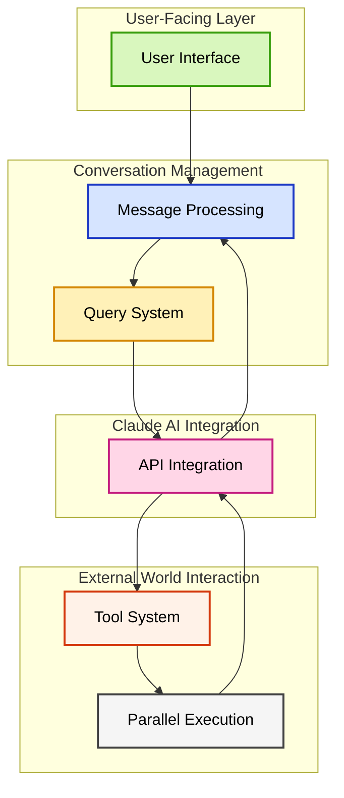
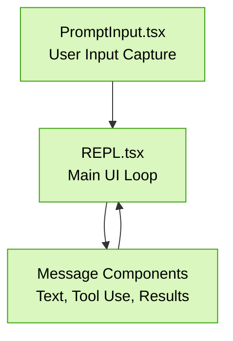
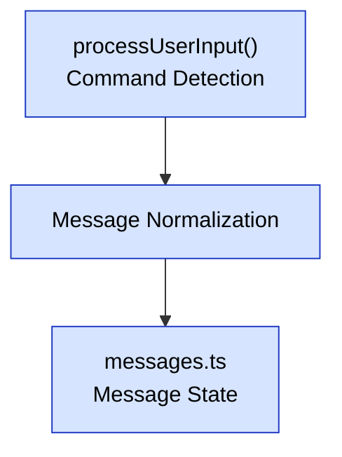
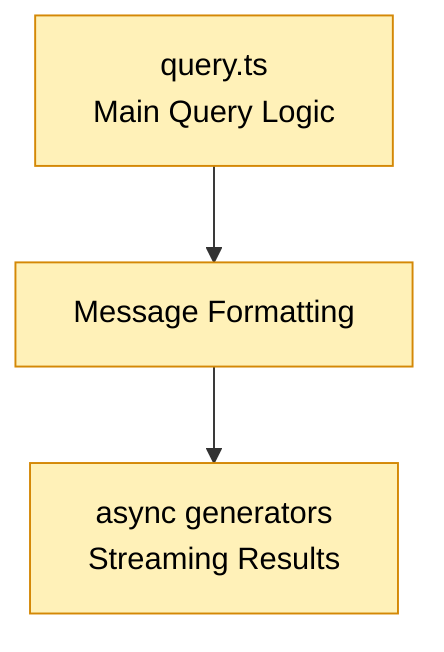
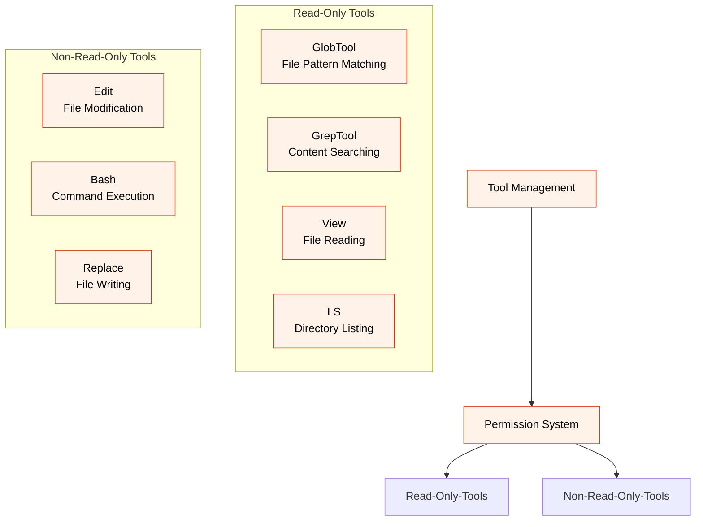
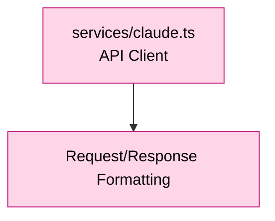
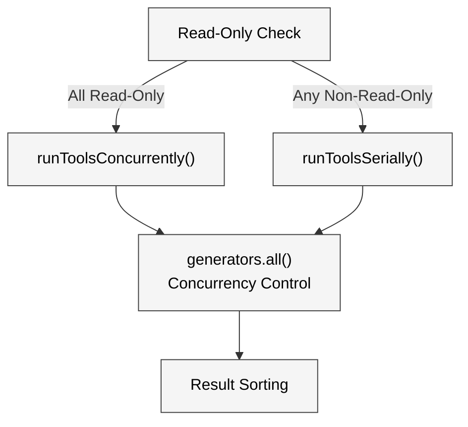
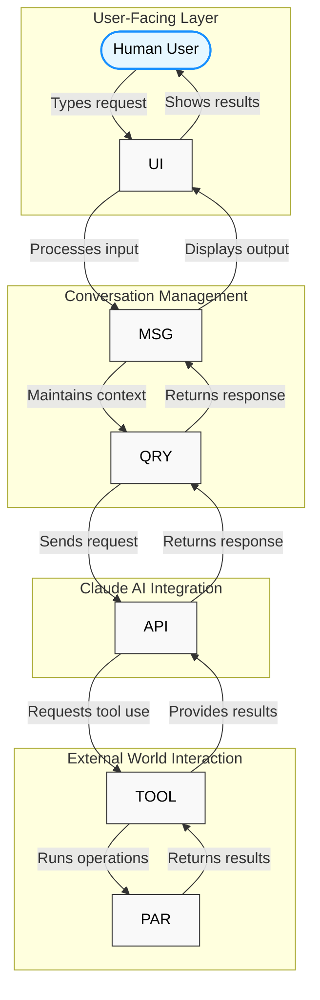

## 系统架构模式

现代 AI 编程助手解决一个核心挑战：在处理复杂操作的同时保持交互的响应性。它们不仅仅是 API 封装，而是各组件协同工作以提供自然编程体验的系统。

<strong>🏗️ 架构理念：</strong> 一个为大型代码库实时交互而设计的系统，其中每个组件在一致的信息流中处理特定的职责。

### 高层架构概览

下图展示了 AI 编程助手的典型架构模式，组织为四个关键领域，展示信息如何在系统中流转：

1. **用户交互层**：你与系统交互的地方
2. **对话管理**：处理消息流并维护上下文
3. **LLM 集成**：连接语言模型的智能能力
4. **外部世界交互**：允许 AI 与文件和你的环境交互

这种组织展示了用户请求的旅程：从用户界面开始，经过对话管理到 AI 引擎，然后在需要时与外部世界交互，最终将结果沿链路返回。

## 关键组件

每个组件在架构中处理特定的工作。让我们先逐一了解它们，然后再看它们如何协同工作。这些组件的详细实现请参见[核心架构](./core-architecture.md)页面。

### 用户界面层

UI 层管理你在终端中看到的内容以及你与 Claude Code 交互的方式。

使用 React 和 Ink 构建以实现丰富的终端交互，UI 的关键创新是其流式能力。它不会等待完整的回答，而是在部分响应到达时立即渲染。

- **PromptInput.tsx** - 捕获用户输入，支持历史导航和命令识别
- **Message Components** - 渲染文本、代码块、工具输出和错误
- **REPL.tsx** - 维护对话状态并编排交互循环

### 消息处理

这一层将原始用户输入转换为系统可以处理的内容。

在生成响应之前，系统需要理解和路由用户输入：

- **processUserInput()** - 通过区分常规提示、斜杠命令（/）和 bash 命令（!）来路由输入
- **消息标准化** - 将不同的消息格式转换为一致的结构
- **messages.ts** - 管理整个对话历史中的消息状态

### 查询系统

查询系统是 Claude Code 的大脑，协调从用户输入到 AI 响应的一切。

<strong>🔑 关键路径：</strong> query.ts 文件包含驱动对话能力的核心逻辑，协调用户输入、AI 处理和工具执行之间的关系。

- **query.ts** - 实现编排对话流的主查询生成器
- **消息格式化** - 准备带有适当上下文的 API 兼容消息
- **异步生成器** - 支持逐 token 流式传输以实现即时反馈

### 工具系统

工具系统让 Claude 与你的环境交互——读取文件、运行命令和进行修改。

这个系统将 Claude Code 与其他编程助手区分开来。Claude 不仅仅是讨论代码，还能直接与代码交互：

- **工具管理** - 注册和管理可用工具
- **只读工具** - 不修改状态的安全操作（GlobTool、GrepTool、View、LS）
- **非只读工具** - 修改文件或执行命令的操作（Edit、Bash、Replace）
- **权限系统** - 在工具能力之间强制执行安全边界

### API 集成

这个组件处理与 Claude API 端点的通信以获取语言处理能力。

- **services/claude.ts** - 管理 API 连接、认证和错误处理
- **请求/响应格式化** - 在内部消息格式和 API 结构之间转换

### 并行执行

Claude Code 的关键性能特性之一是能够并发运行操作，而不是逐一执行。

<strong>🔍 性能模式：</strong> 在搜索代码库时，系统同时检查多个文件而不是顺序执行，显著提升响应时间。

- **只读检查** - 确定请求的工具是否可以安全地并行运行
- **runToolsConcurrently()** - 同时执行兼容的工具
- **runToolsSerially()** - 在顺序重要或安全需要时按序执行工具
- **generators.all()** - 管理多个并发异步生成器的核心工具
- **结果排序** - 无论执行时机如何确保一致的排序

## 集成数据流

现在我们已经了解了每个组件，下面是它们在实践中如何协同工作，领域标注清晰：

这个图展示了四种关键交互模式：

1. **人机交互循环**：你输入请求，Claude Code 处理并显示结果
   * _示例：你问"这段代码是做什么的？"然后得到解释_

2. **AI 咨询**：你的请求被发送给 Claude 进行分析
   * _示例：Claude 分析代码结构并识别设计模式_

3. **环境交互**：Claude 使用工具与你的文件和系统交互
   * _示例：Claude 搜索相关文件、读取它们并进行修改_

4. **反馈循环**：工具的结果反馈到 Claude 的思考中
   * _示例：在读取文件后，Claude 根据发现的内容完善其解释_

Claude Code 的强大之处在于这些模式无缝协作。Claude 不仅仅是讨论代码，还能实时主动地探索、理解和修改代码。
